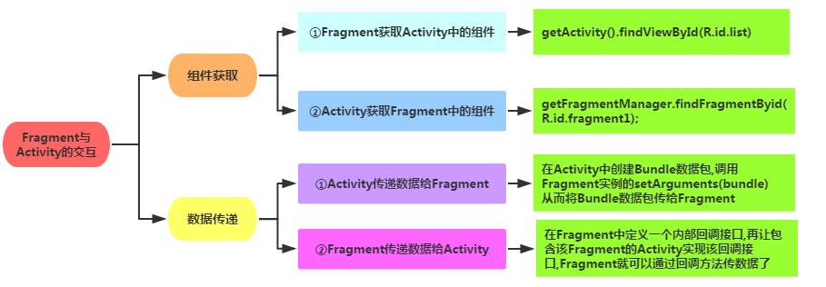

[TOC]

# Fragment生命周期

- onAttach 当Fragment添加到Activity中时回调 , 只会调用一次
- onCreate 创建Fragment时回调 , 只调用一次
- onCreateView
- onActivityCreate 
- `onAttach()`：Fragment和Activity相关联时调用。可以通过该方法获取Activity引用，还可以通过getArguments()获取参数。只被调用一次.
- `onCreate()`：Fragment被创建时调用 , 只被调用一次.
- `onCreateView()` : 每次创建 , 绘制该FragmentView的时候调用 , 需要在此方法中返回绘制的根View.
- `onActivityCreated()`：当Activity完成onCreate()时调用 , 
- `onStart()`：当Fragment可见时调用。
- `onResume()`：当Fragment可见且可交互时调用
- `onPause()`：当Fragment不可交互但可见时调用。
- `onStop()`：当Fragment不可见时调用。
- `onDestroyView()`：当Fragment的UI从视图结构中移除时调用。
- `onDestroy()`：销毁Fragment时调用。
- `onDetach()`：当Fragment和Activity解除关联时调用。

# 核心类

- `Fragment `: 基础元素 , 创建Fragment必然需要继承该类 , 其扩展类还有 : DialogFragment , ListFragment , PreferenshFragment , WebViewFragment.

- `FragmentManager` : 用于管理Fragment的抽象类 , 具体实现是FragmentManagerImp.

- `FragmentTransaction` : 对Fragment的添加 , 删除 和 替换提供事务处理 , 抽象类 , 具体实现是BanckTaskRecord.

# 基本使用

1. 静态加载

 ```xml
 <fragment
     android:id="@+id/my_fragment"
     android:name="com.xxx.MyFragment"
     android:layout_width="match_parent"
     android:layout_height="match_parent"/>
 ```

2. 动态加载

  ```java
  // 建议使用newInstance()方法创建实例
  Fragment fragment = MyFragment.newInstance();
  FragmentManager fragmentManager = getSupportFragmentManager();
  // 开启一个事务
  FragmentTransaction transaction = fragmentManager.beginTransaction();
  transaction.replace(R.id.frame_layout, fragment);
  // 提交后生效
  transaction.commit();
  ```

   上面我们用到了`newInstance()`创建fragment实例 , 这个是父类的方法 , 通常我们会重写,  并在这个方法中传参,  从而让Activity的代码更简洁 . 

   ```java
   public static MyFragment newInstance(String arg1 , String arg2){
   		MyFragment mFragment = new MyFragment();
            	Bundle bundle = new Bundle();
            	bundle.putString("arg1", arg1);
            	bundle.putString("arg2", arg2);
            	mFragment.setArguments(bundle);
   }
   ```
  
  **更重要的是 , 这里使用`setArguments()`方法来传递参数** , 这再横竖屏切换时才不会导致参数丢失 , 因为Fragment是有自己封装的生命周期的，这一点和Activity类似，Activity传参也不是用构造方法的方式 .  
  
如果我们调用时使用`setArguments()`传递了Bundle,它会被保存在Fragment的`mArguments` 这个私有声明中.
  而如果是通过构造函数传递的参数,那很不幸，Fragment重建过程中，并没有持有相应参数的属性或方法，自然，你通过构造函数传递的参数就丢失了.

# Fragment与Activity通信



上图已经给出了比较全面的解析 , 但仍要说的是 , Fragmen其实就相当于一个你自定义的控件 , 一个完整的控件一定会具备相应外部操作的功能 , 即 **内部操作后需要对外部通知 , 外部发生改变后也可以通知到内部** , 这就是核心理念 . 那么**完成这些功能的方法无外乎回调和对外提供方法.**

# 回退栈

类似Android系统为Activity维护一个任务栈，我们也可以通过Activity维护一个回退栈来保存每次Fragment事务发生的变化。如果你将Fragment任务添加到回退栈，当用户点击后退按钮时，将看到上一次的保存的Fragment。
 一旦Fragment完全从后退栈中弹出，用户再次点击后退键，则退出当前Activity.

```java
private void replaceFragment(Fragment fragment) {
    FragmentManager fragmentManager = getSupportFragmentManager();
    FragmentTransaction transaction = fragmentManager.beginTransaction();
    transaction.replace(R.id.right_layout, fragment);
  	//添加进回退栈
    transaction.addToBackStack(null);   
    transaction.commit();
}
```

**replace是remove和add的合体**，并且如果不添加事务到回退栈，前一个Fragment实例会被销毁。这里很明显，我们调用`transaction.addToBackStack(null)`;将当前的事务添加到了回退栈，所以FragmentOne实例不会被销毁，但是视图层次依然会被销毁，即会调用`onDestoryView和onCreateView`

如果不希望视图重绘，可以将原来的Fragment隐藏：

```java
private void replaceFragment(Fragment fragment) {
    FragmentManager fragmentManager = getSupportFragmentManager();
    FragmentTransaction transaction = fragmentManager.beginTransaction();
    transaction.hide(this);
    transaction.add(R.id.right_layout, fragment);
    transaction.addToBackStack(null);   //添加进回退栈
    transaction.commit();
}
```

# 常用框架

对于Fragment的管理已经有了很多强大的框架帮你完成 . 

- Navigation : 谷歌2018年推出的JetPack中包含了这一框架 , 用于管理Fragment , 同时也可以管理Activity.
- Fragmentation : 有了它你甚至不会感觉到自己在用Fragment.

参考链接 :

[Fragment基本使用](https://www.jianshu.com/p/421cc442f06c)

[Fragment的创建](https://blog.csdn.net/lebang08/article/details/55669178)

[Fragment生命周期](https://blog.csdn.net/asdf717/article/details/51383750)