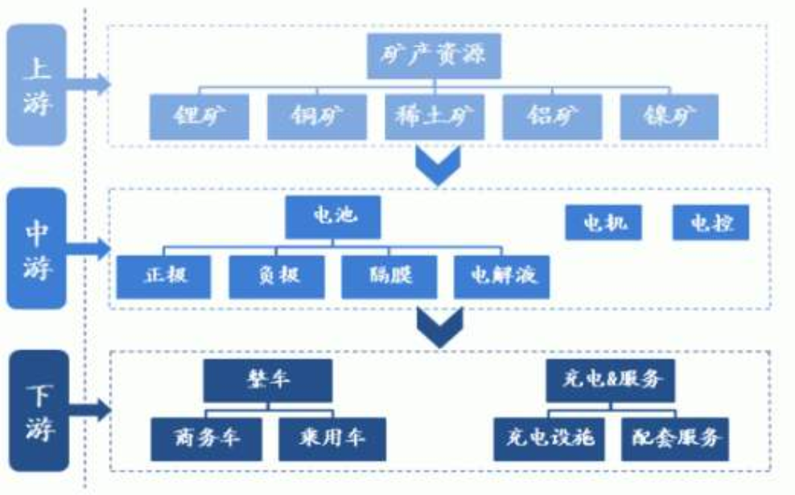

[TOC]

# 核心逻辑

- 机构分析
  - 19年给了350亿到370亿的财政补给，实际按照今年的销量，大概还有110亿的盈余。
  - 从19年10月开始 , 海外电动车市场增加补贴.
  - 特斯拉
  - GWH扩展
  - 国外市场的冲击
  - 
- 个人理解
  - 为什么偏偏是2020年这个时间节点? 有几个预期 , 即将出台的政策 / 
  - 先看历史 , 锂电池这个行业在2016-2 ~ 2016-7大涨 . 而2016年1月份的时候 , 百度搜索新能源汽车 , 确定性信息并不多 , 也就是说 , 大多是 "预计" , 预计出台政策 , 预计进入加速 , 预计XXX... , 而一直到6月份 , 真正预计的事情都发生了 , 之前所有预计出台的政策在6月份左右已经相继出台完成了. 而行情开始横盘 , 2017-9-29 , 开始下跌 . 再结合个人的一些主观理解, 可能是如下情况 :
    16年1月份开始陆续有消息指向电动车行业,  而股票就是炒预期, 所以在2月-6月的时候大涨 , 直到所有的政策都出台后, 无论从k线高度还是实际市场销售情况 , 都不适合再涨了,  出现了横盘, 和小幅度回升 , 最后大跌.
  - 电车补贴计划是2016 - 2020年 , 其实补贴可以代表中国对电动车的一种态度 , 而对进口电动车减税则更是坚定了态度 , 前者并没有对行业的发展带来帮助反而弄乱了市场, 后者则是对前者的弥补 . 所以补贴不补贴的对市场影响不大 , 反倒是对韭菜的心理影响更大 , 对市场发展有重大影响的应该是国外先进技术的冲击 .
  - 电动车是一个可以长期炒的题材, 因为短期内电动车还不能非常彻底的普及 , 无非是一些商用车占比 , 相比于私家车简直不值一提 . 后续对市场影响非常大的信息刺激应该是 : 废旧电池处理 , 充电优化 , 续航提升 , 特斯拉新技术 , 价格调整 , 新规出台等 , 其中充电优化应该会引爆这个市场.

# 产业链

补充 , 钴

# 重点关注

宁德时代 / 

# 动态记录

- 宁德时代并未与特斯拉有实质性的合作
- 目前来看这波行情应该就特斯拉还强一点 , 其他逻辑都瞎几把扯淡.