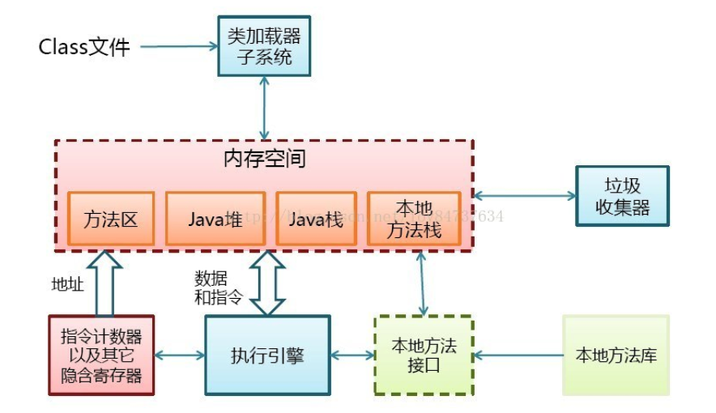

[TOC]

> 编译的全过程?
>
> 程序启动的入口在哪?
>
> 谁去加载的Classloader?

# JVM , Dalvik , ART

## 虚拟机是干嘛的

为了实现"写一次 , 到处跑" , 将java文件转换后的字节码 , 在运行期转换为不同平台的机器码. 所以可以理解为虚拟机的核心功能就是在运行期对class文件的管理 .

其实不只是JAVA , 其他例如C# / .NET等高级语言都是需要虚拟机的 , 他就像你和机器之间的一个翻译 .

## JVM , Dalvik 和 ART 之间的区别

JVM是一切的起源 , Dalvik是在JVM基础上做改造 , 使得变得更加适用于移动设备. 而ART则是对Dalvik的优化 , 加入了JIT机制 , 为了更好的兼容 , 同样也是基于JVM的.
具体体现如下:

1. 接收的编译文件格式不同 dvm是 .dex , jvm是.class , .dex其实就是所有.class文件的合体 , 所以Android经常会出现方法超过65535问题.
2. GC机制不同 , jvm是在每个类的头部留一段空间来存储GC标记 , 而dvm则是在GC时申请单独的空间.

总结就是 , Dalvik的一切改造都是基于节省内存的.

## 如何工作

这里讨论的是JVM , 因为他是一切虚拟机的源头 , 你也可以抽象的理解其中的核心思想 , 因为大多数虚拟机的核心理念都是相似的.

JVM的运行可以看做两部分:

1. ### **编译器** 

   也就是我们经常用的 javac. 在这一步会**将java文件编译为通用的中间形式的.class文件**. 在这个过程中会进行词法分析、语法分析、语义分析，编译原理中这部分的编译称为前端编译 . 
   在AndroidStudio中我们常会看到.class文件 , 跟.java文件一样 , 这其实是studio为我们进行了自动转换 , .class就是字节码 , 直接看是很难看懂的 . 同时 , .class还会为做一些添砖加瓦的工作 , 例如定义了一个类 , .java文件中并没有写任何构造函数 , 但是.class文件中是有一个无参构造函数的 . 又例如泛型的擦除机制 , 也是发生在编译阶段 .

   所以 , 对于Android而言在这一步可以做什么? 插桩 , 加固 , 优化编译速度等 , 同时 , 为什么kotlin支持协程而java不支持? 我想是因为java编译器不支持 , 无法将java代码编译成c的协程实现 , 假如哪天实现了 , java也能愉快的使用协程了. 可以说kotlin只是使用了一个更为高级的编译器 . 以上为个人观点 , 不知对错 . 

   

2. ### **解释器** 

   **解释器逐条将字节码解释为机器码来执行** , 这也是为何Java运行速度慢的原因 , 而JIT的加入大幅缓解了这种问题. 这里先忽略他.

   

   

# JIT

JIT（Just In Time，即时编译技术）对于热点代码（使用频率高的字节码）直接转换成汇编代码 . 

# 

JVM / Dalvik / ART

