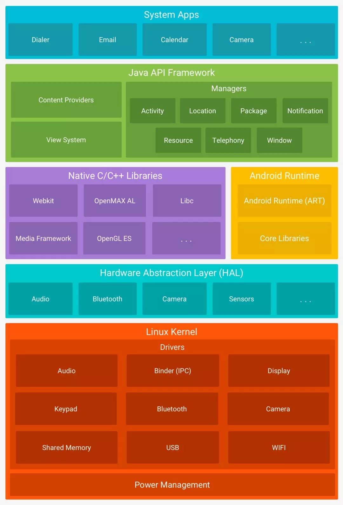
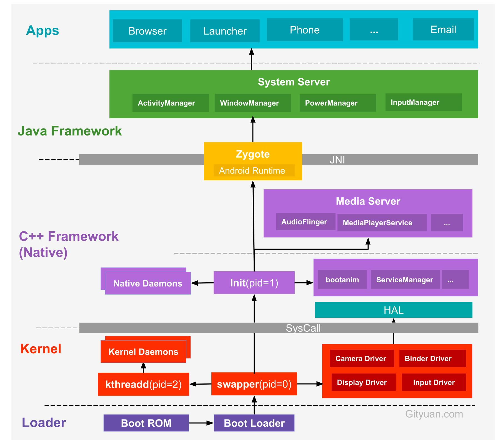
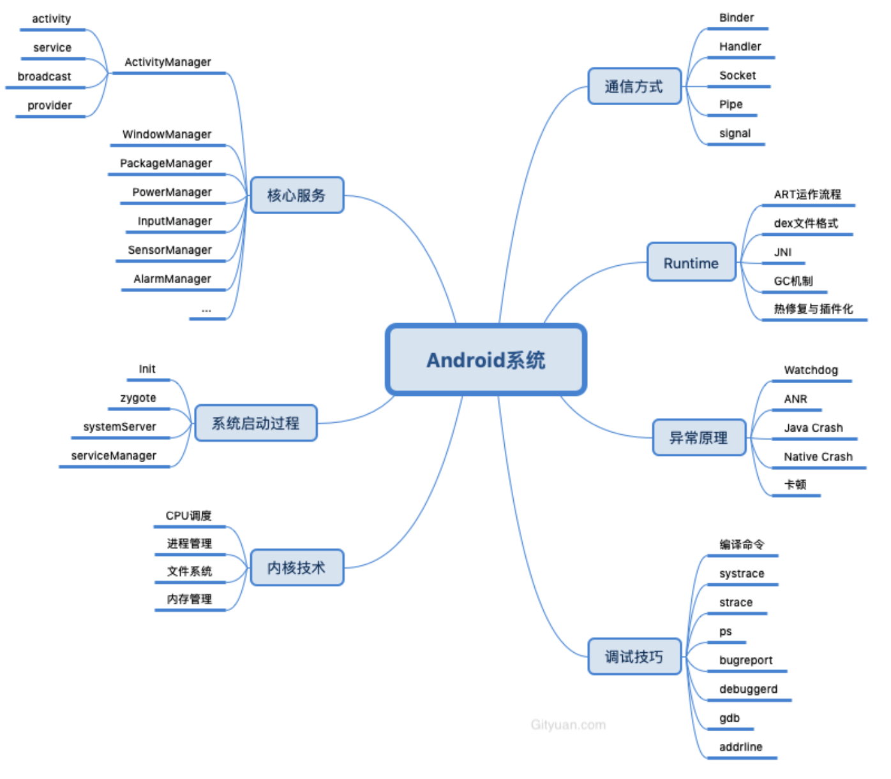

`16:22` - `16:38`  

`16:40` - `16:56`  

`17:33` - `17:22`  

首先是**反射/注解/泛型** , 这个是基础 , 否则很难写出框架类的东西.

然后是**ClassLoader** , 这个是核心 , 大多数框架类的代码也会用到这个.

但是在学习ClassLoader的时候 , 需要理解他的工作原理 .
ClassLoader是被谁加载的? 什么时候加载的? 这就涉及到了**虚拟机** . 

在学习虚拟机的时候 , 看到Zegote , 又涉及到了部分**Liunx**的东西 , 比如fork , 本想先全面的看下整套Android系统的结构及原理. 但是这块儿太大了 , 放到最后. 着重看Liunx的

最终再回到ClassLoader , 深入理解ClassLoader的使用.


- 反射相关 . 反射的原理是什么?
  - Classloader . Classloader是谁管理的? 
    - 虚拟机 . 虚拟机是什么? 谁管理的?
      - Zegote . Zegot是个进程 , 那进程是个什么机制? 谁管理的?
        - Liunx的fork . 

## 开机

Google的系统结构图:




系统启动架构图:



#### 关于Loader层：

- Boot ROM: 当手机处于关机状态时，长按Power键开机，引导芯片开始从固化在`ROM`里的预设代码开始执行，然后加载引导程序到`RAM`；
- Boot Loader：这是启动Android系统之前的引导程序，主要是检查RAM，初始化硬件参数等功能。


#### Linux内核层 : 

- 启动Kernel的**swapper进程**(pid=0)：该进程又称为idle进程, 系统初始化过程Kernel由无到有开创的第一个进程, 用于初始化进程管理、内存管理，加载Display,Camera Driver，Binder Driver等相关工作；
- 启动kthreadd进程（pid=2）：是Linux系统的内核进程，会创建内核工作线程kworkder，**[软中断](https://baike.baidu.com/item/%E8%BD%AF%E4%B8%AD%E6%96%AD/3572546?fr=aladdin)线程ksoftirqd**，thermal等内核守护进程。`kthreadd进程是所有内核进程的鼻祖`。


#### 硬件抽象层 (HAL)

硬件抽象层 (HAL) 提供标准接口，HAL包含多个库模块，其中每个模块都为特定类型的硬件组件实现一组接口，比如WIFI/蓝牙模块，当框架API请求访问设备硬件时，Android系统将为该硬件加载相应的库模块。


#### Android Runtime & 系统库

这里的Native系统库主要包括init孵化来的用户空间的守护进程、HAL层以及开机动画等。启动init进程(pid=1),是Linux系统的用户进程，**`init进程是所有用户进程的鼻祖`**。

- init进程会孵化出ueventd、logd、healthd、installd、adbd、lmkd等用户守护进程；
- init进程还启动`servicemanager`(binder服务管家)、`bootanim`(开机动画)等重要服务
- **init进程孵化出Zygote进程**，Zygote进程是Android系统的第一个Java进程(即虚拟机进程)，`Zygote是所有Java进程的父进程`，Zygote进程本身是由init进程孵化而来的。


#### Framework层

- Zygote进程，**是由init进程通过解析init.rc文件后fork生成的**，Zygote进程主要包含：
  - 加载ZygoteInit类，注册Zygote Socket服务端套接字
  - 加载虚拟机
  - 提前加载类preloadClasses
  - 提前加载资源preloadResouces
- System Server进程，是由Zygote进程fork而来，`System Server是Zygote孵化的第一个进程`，System Server负责启动和管理整个Java framework，包含ActivityManager，WindowManager，PackageManager，PowerManager等服务。
- Media Server进程，是由init进程fork而来，负责启动和管理整个C++ framework，包含AudioFlinger，Camera Service等服务。


#### App层

- Zygote进程孵化出的第一个App进程是Launcher，这是用户看到的桌面App；
- Zygote进程还会创建Browser，Phone，Email等App进程，每个App至少运行在一个进程上。
- 所有的App进程都是由Zygote进程fork生成的。


#### Syscall && JNI

- Native与Kernel之间有一层系统调用(**SysCall**)层，见[Linux系统调用(Syscall)原理](http://gityuan.com/2016/05/21/syscall/);
- Java层与Native(C/C++)层之间的纽带**JNI**，见[Android JNI原理分析](http://gityuan.com/2016/05/28/android-jni/)。


##### Android系统中极其重要进程：

- init : Linux系统中用户空间的第一个进程, Init.main
- zygote : 所有Ａpp进程的父进程, ZygoteInit.main
- system_server : 系统各大服务的载体, SystemServer.main , forkSystemServer过程
- servicemanager : binder服务的大管家, 守护进程循环运行在binder_loop





每个App都在其自己的进程中运行，都有自己的虚拟机实例。每一个AndroidApp都是由Zegote进程fork出的一个新进程 , 但是并没有全部fork过来 , 只是关键信息.

ART主要功能包括：预先(AOT)和即时(JIT)编译，优化的垃圾回收(GC)，内联 , 以及调试相关的支持。


Android源码网站 : http://androidxref.com/


[Android 操作系统架构开篇](http://gityuan.com/android/) 高质量


```
Makefile
|-- bionic                    （bionic C库）
|-- bootable                  （启动引导相关代码）
|-- build                     （存放系统编译规则及generic等基础开发包配置）
|-- cts                       （Android兼容性测试套件标准）
|-- dalvik                    （dalvik JAVA虚拟机）
|-- development               （应用程序开发相关）
|-- external                  （android使用的一些开源的模组）
|-- frameworks                （核心框架——java及C++语言）
|-- hardware                  （部分厂家开源的硬解适配层HAL代码）
|-- out                       （编译完成后的代码输出与此目录）
|-- packages                  （应用程序包）
|-- prebuilt                  （x86和arm架构下预编译的一些资源）
|-- sdk                       （sdk及模拟器）
|-- system                    （底层文件系统库、应用及组件——C语言）
`-- vendor                    （厂商定制代码）
```