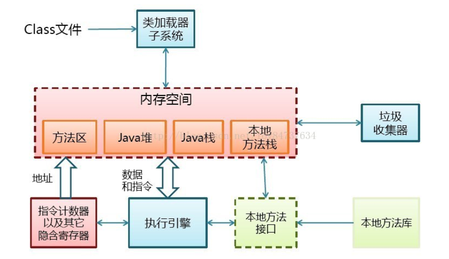

[TOC]

> 编译的全过程?
>
> 程序启动的入口在哪?

# JVM , Dalvik , ART

## 虚拟机是干嘛的

为了实现"写一次 , 到处跑" , 将java文件转换后的字节码 , 在运行期转换为不同平台的机器码. 所以可以理解为虚拟机的核心功能就是在运行期对class文件的管理 .

其实不只是JAVA , 其他例如C# / .NET等高级语言都是需要虚拟机的 , 他就像你和机器之间的一个翻译 .

## JVM , Dalvik 和 ART 之间的区别

JVM是一切的起源 , Dalvik是在JVM基础上做改造 , 使得变得更加适用于移动设备. 而ART则是对Dalvik的优化 , 加入了JIT机制 , 为了更好的兼容 , 同样也是基于JVM的.
具体体现如下:

1. 接收的编译文件格式不同 dvm是 .dex , jvm是.class , .dex其实就是所有.class文件的合体 , 所以Android经常会出现方法超过65535问题.
2. GC机制不同 , jvm是在每个类的头部留一段空间来存储GC标记 , 而dvm则是在GC时申请单独的空间.

总结就是 , Dalvik的一切改造都是基于节省内存的.

## 如何工作

这里讨论的是JVM , 因为他是一切虚拟机的源头 , 你也可以抽象的理解其中的核心思想 , 因为大多数虚拟机的核心理念都是相似的.

### 如何启动

我们的Android应用是如何在虚拟机上启动的?

那就从手机的开机说起. 开机实则就包含了初始化虚拟机的工作. 

- 虚拟机里的一些重要参数及方法.

  > Dalvik虚拟机和ART虚拟机都实现了如下3个用来抽象Java虚拟机的接口. 
  >
  > - JNI_GetDefaultJavaVMInitArgs：获取虚拟机的默认初始化参数。
  > - JNI_CreateJavaVM：在进程中创建虚拟机实例。
  > - JNI_GetCreatedJavaVMs：获取进程中创建的虚拟机实例。
  >
  > 在android系统中，Dalvik虚拟机实现在libdvm.so文件中，ART虚拟机实现在libart.so文件中。此外，android系统还提供了一个系统属性persist.sys.dalvik.vm.lib，其值等于libdvm.so或libart.so，当等于libdvm.so时，表示当前用的是Dalvik虚拟机，当用的是libart.so时，表示当前用的是ART虚拟机。

- 运行app_process进程

  当android系统启动后会创建一个zygote进程，作为应用程序的进程孵化器，并且在启动zygote进程的过程中会创建一个Dalvik虚拟机。

  zygote进程是通过复制自己来创建新的应用程序进程的，这意味着zygote进程会将自己的Dalvik虚拟机复制给应用程序进程。上述方式可以大大提高应用程序的启动速度，因为这种方式避免了每一个应用程序进程在启动时都要去创建一个Dalvik。

  事实上，zygote进程通过自我复制的方式来创建应用程序进程，省去的不仅仅是应用程序创建Dalvik虚拟机的时间，还能省去应用程序加载各种系统库和系统资源的时间，因为它们在zygote进程中已经加载过了，并且也会连同Dalvik虚拟机一起复制到应用程序中去。这也是ART优于Dalvik的原因。

### 虚拟机的运行

JVM的运行可以看做两部分:

1. ### **编译器** 

   也就是我们经常用的 javac. 在这一步会**将java文件编译为通用的中间形式的.class文件**. 在这个过程中会进行词法分析、语法分析、语义分析，编译原理中这部分的编译称为前端编译 . 
   在AndroidStudio中我们常会看到.class文件 , 跟.java文件一样 , 这其实是studio为我们进行了自动转换 , .class就是字节码 , 直接看是很难看懂的 . 同时 , .class还会为做一些添砖加瓦的工作 , 例如定义了一个类 , .java文件中并没有写任何构造函数 , 但是.class文件中是有一个无参构造函数的 . 又例如泛型的擦除机制 , 也是发生在编译阶段 .

   > 所以 , 对于Android而言在这一步可以做什么? 插桩 , 加固 , 优化编译速度等 , 同时 , 为什么kotlin支持协程而java不支持? 我想是因为java编译器不支持 , 无法将java代码编译成c的协程实现 , 假如哪天实现了 , java也能愉快的使用协程了. 可以说kotlin只是使用了一个更为高级的编译器 . 这一点从java使用javac编译 , 而kotlin使用kotlinc编译就可以看出 .

   

2. ### **解释器** 

   见下节.

## 解释器

解释器是在运行时工作的 , **解释器逐条将字节码解释为机器码来执行** , 这也是为何Java运行速度慢的原因 .

解释器的解析速度是体现一个虚拟机优异程度的重要指标 . 所以对解析速度的优化从未停止过. 在最初的JVM中 , 解析器逐条将字节码解释为机器码 , 在效率上非常低下 , 而JIT的引入 , 则大大提升了JVM的运行速度 , 甚至堪比   IBM的JVM会比Sun公司的JVM速度快上30%左右 , 但你若替换则需要使用它的全家桶 . 

我们通常用到的ClassLoader , 则是解释器中一个重要的角色.

解释器分为两部分 : 

1. Client Compiler

# JIT

JIT（Just In Time，即时编译技术）对于热点代码（使用频率高的字节码）直接转换成汇编代码 . 

# 

JVM / Dalvik / ART

