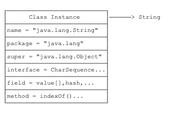
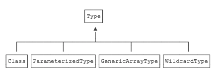

[TOC]

# 反射

反射是为了解决在运行期，对某个实例一无所知的情况下，如何调用其方法。

JVM在执行过程中(运行时?) 动态加载类 , 每遇到一种没有见过的class就将其加载到内存中. 注意不是对象 , 而是Class类型 ,  一种类型就加载一个.

## Class

他的本质就是类型  , 我理解的 , Class就是一个统一格式的块儿 , 里面包含了一个类可以有的所有信息 , 比如`field[](变量)` , `methode[](方法)` , `name(类名)`...  方便JVM管理?

Class的样子:


### 获取Class的三种方法

1. 通过.class的静态变量获取到这个Class , .class这个变量在哪?

2. 通过Object的getClass获取

3. 通过Class.forName("java.lang.String")获取

> 注意 , 获取到的class实例 , 通常我们会用instanceof 来检查是否是指定类型 , 同样的 , 我们也可以用==类判断 , 不同的是 , instanceof是包含其子类的. 比如  String instanceof Object  = true .

### Class这个类的关系结构?

> implements   java.io.Serializable,   GenericDeclaration ,  Type , AnnotatedElement , 有一个地方比较奇怪 , GenericDeclaration接口给继承自AnnotatedElement , 但Class自己又实现了一遍?

### Class的基本信息

```java
public class Main {
    public static void main(String[] args) {
        printClassInfo("".getClass());
        printClassInfo(Runnable.class);
        printClassInfo(java.time.Month.class);
        printClassInfo(String[].class);
        printClassInfo(int.class);
    }

    static void printClassInfo(Class cls) {
        System.out.println("Class name: " + cls.getName());
        System.out.println("Simple name: " + cls.getSimpleName());
        if (cls.getPackage() != null) {
            System.out.println("Package name: " + cls.getPackage().getName());
        }
        System.out.println("is interface: " + cls.isInterface());
        System.out.println("is enum: " + cls.isEnum());
        System.out.println("is array: " + cls.isArray());
        System.out.println("is primitive: " + cls.isPrimitive());
    }
}
```


## 字段 Field

### 获取字段

- Field getField(name)：根据字段名获取某个public的field（包括父类）
- Field getDeclaredField(name)：根据字段名获取当前类的某个field（不包括父类）
- Field[] getFields()：获取所有public的field（包括父类）
- Field[] getDeclaredFields()：获取当前类的所有field（不包括父类）

### 获取Field的更多信息

```java
Field f = String.class.getDeclaredField("value");
f.getName(); // "value"
f.getType(); // class [B 表示byte[]类型
int m = f.getModifiers();
Modifier.isFinal(m); // true
Modifier.isPublic(m); // false
Modifier.isProtected(m); // false
Modifier.isPrivate(m); // true
Modifier.isStatic(m); // false
```

### 操作字段的值

- 获取 `f.get(Object o)`

通过get()方法 , 传入指定的实例 , 便可以拿到该实例对应的字段值.

- 写入 `f.set(Object o)`
  对于private的字段 , 需要先将其改为public :  f.setAccessible(true);

- 对于private的字段 , 在get和set之前 , 都需要先调用`f.setAccessible(true); ` 意思是，别管这个字段是不是public，一律允许访问.

> 注意 , setAccessible(true)可能会失败。如果JVM运行期存在SecurityManager，那么它会根据规则进行检查，有可能阻止setAccessible(true)。例如，某个SecurityManager可能不允许对java和javax开头的package的类调用setAccessible(true)，这样可以保证JVM核心库的安全。
>
> SecurityManager是什么?

## 方法 Method

### 获取Method的Api

- Method getMethod(name, Class...)：获取某个public的Method（包括父类） 

- Method getDeclaredMethod(name, Class...)：获取当前类的某个Method（不包括父类） 

- Method[] getMethods()：获取所有public的Method（包括父类）

- Method[] getDeclaredMethods()：获取当前类的所有Method（不包括父类）

### 进一步获取更多信息

- getName()：返回方法名称，例如："getScore"；
- getReturnType()：返回方法返回值类型，也是一个Class实例，例如：String.class；
- getParameterTypes()：返回方法的参数类型，是一个Class数组，例如：{String.class, int.class}；
- getModifiers()：返回方法的修饰符，它是一个int，不同的bit表示不同的含义。

### 调用方法  `m.invoke()`

```java
// String对象:
String s = "Hello world";
// 获取String substring(int)方法，参数为int:
Method m = String.class.getMethod("substring", int.class);
// 在s对象上调用该方法并获取结果:
String r = (String) m.invoke(s, 6);
```

### 关于静态方法

一般的方法调用invoke() , 第一个参数都需要传入实例的引用 , 而静态方法的invoke()第一个参数永远传null. 而对于private方法 , 和字段一样 , 在使用之前先调用setAccessible(true).


## 调用构造器 Constructor

### 获取Constructor的API

- getConstructor(Class...)：获取某个public的Constructor； 
- getDeclaredConstructor(Class...)：获取某个Constructor；
- getConstructors()：获取所有public的Constructor； 
- getDeclaredConstructors()：获取所有Constructor。

### 通过 `newInstance()` 调用构造器

```java
// 获取构造方法Integer(int):
Constructor cons1 = Integer.class.getConstructor(int.class);
// 调用构造方法:
Integer n1 = (Integer) cons1.newInstance(123);
System.out.println(n1);
// 获取构造方法Integer(String)
Constructor cons2 = Integer.class.getConstructor(String.class);
Integer n2 = (Integer) cons2.newInstance("456");
System.out.println(n2);
```

> **同样的private的构造器扔可以通过setAccessible(true)来调用**

### 对于Class判断是否类型相同

对于一个实例而言 , 我们通常会使用 `instanceof`
而对于Class而言 , 需要使用`isAssignableFrom()` 

```java
// Integer i = ?
Integer.class.isAssignableFrom(Integer.class); // true，因为Integer可以赋值给Integer
// Number n = ?
Number.class.isAssignableFrom(Integer.class); // true，因为Integer可以赋值给Number
// Object o = ?
Object.class.isAssignableFrom(Integer.class); // true，因为Integer可以赋值给Object
// Integer i = ?
Integer.class.isAssignableFrom(Number.class); // false，因为Number不能赋值给Integer
```

### 获取继承关系

```java
// 获取父类
Class i = Integer.class;
Class n = i.getSuperclass();
// 获取接口或获取接口的父类
Class[] is = s.getInterfaces();
```


## 注解 Annotation

### 注解特性

- **分为三类**

  - 编译器使用的注解 , 不会被编译进.class文件 , 编译后就被扔掉了.

  - 工具处理.class的注解 , 比如在加载.class的时候对class做动态的修改.

  - 加载进JVM的注解  , 运行时注解.
- **传参**
  注解的参数是可以写默认值的.


### 元注解 meta annotation

就是注解的注解 , 用来修饰注解 , 下面是一些常用的元注解:

- ##### @Target - 用来定义注解的作用位置 , 方法 / 字段..等.

  > - 类或接口：`ElementType.TYPE`；
  > - 字段：`ElementType.FIELD`；
  > - 方法：`ElementType.METHOD`；
  > - 构造方法：`ElementType.CONSTRUCTOR`；
  > - 方法参数：`ElementType.PARAMETER`。
  
- ##### @Retention - 定义了`Annotation`的生命周期

  > - 仅编译期：`RetentionPolicy.SOURCE`；
  > - 仅class文件：`RetentionPolicy.CLASS`；
  > - 运行期：`RetentionPolicy.RUNTIME`。

- ##### @Repeatable - 是否可重复

  > ```java
  > @Repeatable(Reports.class)
  > @Target(ElementType.TYPE)
  > public @interface Report {
  >     int type() default 0;
  >     String level() default "info";
  >     String value() default "";
  > }
  > ```
  >
  > 添加后就可以添加多个相同的注解了
  >
  > ```java
  > @Report(type=1, level="debug")
  > @Report(type=2, level="warning")
  > public class Hello {
  > }
  > ```

- ##### @Inherited - 子类是否可用集成父类的注解

  > > 仅针对`@Target(ElementType.TYPE)`类型的`annotation`有效，并且仅针对`class`的继承，对`interface`的继承无效
  >
  > ```java
  > @Inherited
  > @Target(ElementType.TYPE)
  > public @interface Report {
  >  int type() default 0;
  >  String level() default "info";
  >  String value() default "";
  > }
  > ```
  > 加上该注解后 :
  >
  > ```java
  > @Report(type=1)
  > public class Person {
  > }
  > 
  > // 子类同样拥有该注解
  > public class Student extends Person {
  > }
  > ```


### 自定义注解

```java
// 3. 使用这两个必填的元注解
@Target(ElementType.TYPE)
// 这里一般都用RUNTIME , 运行时注解
@Retention(RetentionPolicy.RUNTIME)
// 1. 使用@interface定义一个注解
public @interface Report {
  // 2. 定义参数并设置默认值
  int type() default 0;    
  String level() default "info";    
  String value() default "";
}
```

### 使用注解

我们知道了如何定义注解 , 有什么用呢?

这里只说第三种 , RUNTIME注解 , 第一种是给编译器看的 , 第二种是编译时使用的(ASM可能会用到) , 第三种我们比较常用.

1. **定义注解**

   ```java
   @Retention(RetentionPolicy.RUNTIME)
   @Target(ElementType.FIELD)
   public @interface Range {
       int min() default 0;
       int max() default 255;
   }
   ```

2. **添加注解**

   ```java
   public class Person {
       @Range(min=1, max=20)
       public String name;
   
       @Range(max=10)
       public String city;
   }
   ```

3. **通过反射获取注解**

   ```java
   Person person = new Person();
   // 遍历所有Field:
   for (Field field : person.getClass().getFields()) {
     // 获取Field定义的@Range:
     Range range = field.getAnnotation(Range.class);
     // 如果@Range存在:
     if (range != null) {
       // 获取Field的值:
       Object value = field.get(person);
       // 如果值是String:
       if (value instanceof String) {
         String s = (String) value;
         // 判断值是否满足@Range的min/max:
         if (s.length() < range.min() || s.length() > range.max()) {
           // TODO 超出范围
         }
       }
     }
   }
   ```


# 泛型

泛型是一种“代码模板”，可以用一套代码套用各种类型。

看看下面这段代码:

```java
    public static void main(String[] args) {
        Fruit[] fruit = new Apple[10];
        fruit[0] = new Apple(); // 没问题
        fruit[1] = new Jonathan(); // 没问题
        fruit[0] = new Fruit(); // 报错 : ArrayStoreException

    }
    static class Fruit {}
    static class Apple extends Fruit {}
    static class Jonathan extends Apple {}
    static class Orange extends Fruit {}
```

但是上面的情况在编译阶段是不会报错的  , 泛型在很大程度上解决了这种问题.


## 擦拭法

不同语言的泛型实现方式不一定相同。Java语言的泛型实现方式是擦拭法（Type Erasure）。

所谓擦拭法是指，**虚拟机对泛型其实一无所知，所有的工作都是编译器做的**。也就是说 , **你定义的泛型是给编译器看的 , 在运行时虚拟机是看不到的** , 全是Object , 在需要转型的时候，编译器会根据`T`的类型自动为我们实行安全地强制转型 .

例如:

```java
// ----- > 你看到的:
public class Pair<T> {
    private T first;
    public Pair(T t) {
    }
}

// ----- > JVM看到:
public class Pair {
    private Object first;
    public Pair(Object t) {
    }
}
```


因此:

- `<T>`不能是基本类型，例如`int`，因为实际类型是`Object`，`Object`类型无法持有基本类型.

- 无法取得带泛型的`Class`。例如：

  ```java
  Pair<String> p1 = new Pair<>("Hello", "world");
  Pair<Integer> p2 = new Pair<>(123, 456);
  Class c1 = p1.getClass();
  Class c2 = p2.getClass();
  // 注意 , 这里c1和c2是同一个Class , 都是Pair.class , 跟泛型没关系.
  System.out.println(c1==c2); // 打印 : true
  // 并不存在Pair<String>.class 和 Pair<Integer>.class
  System.out.println(c1==Pair.class); // 打印 : true
  ```

- 注意:

  ```java
  public class Pair<T> {
    	// 这个方法定义的对吗?
      public boolean equals(T t) {
          return this == t;
      }
  }
  
  // ----擦除后:
  
  public class Pair {
    	// 转换后 , 这个方法就和Object的equals方法冲突了.
    	// 编译器会阻止一个实际上会变成覆写的泛型方法定义
      public boolean equals(Object t) {
          return this == t;
      }
  }
  ```


## 获取泛型的真实类型

既然运行时被擦除了 , 什么时候可以获取到泛型的真是类型?

> 首先让我们思考一下 , 泛型只是给编译器看的吗? 
>
> 我个人理解 , 首先 , 泛型确实是给编译器看的 , 但最终目的是什么?是保证你在敲代码的时候别乱传值 , 导致运行期类型错误 . 所以 , 一旦到了运行期 , 中间部分的泛型是不是就没用了? 擦除 , 其实就是转换 , 转换成Object , 这个你即使可以拿到也没用 . 
>
> 但是真正使用这个泛型的地方就不一样了 , 他必须是要替换成他的真实类型的 , 因为他要参与运行 , 所以说 , 我们可以得出一个结论 , **真正使用的的地方可以获取到真实类型 , 传递过程中的地方 , 获取不到真实类型.**

**在父类是泛型类型的情况下 , 我们可以拿到泛型的真实类型 . ** 

java在编译的时候会检测父类的范型信息，因为子类声明了范型的类型并且在子类的代码中会使用到该类型，所以java会在生成的class中记录该子类声明的范型类型. 所以:

**方法返回值 , 我们也可以拿到泛型的真实类型 . ** 

**字段 , 我们也可以拿到泛型的真实类型 . ** 

**方法的参数 , 我们也以拿到泛型的真实类型 . ** 

例如 : 

```java
// 父类
public static class Pair<T> { ... }
// 子类
public static class IntPair extends Pair<Integer> { ... }


// 通过反射获取父类的泛型的真实类型 , 确切的说应该是获取保存在子类的泛型的实现类型.
Class<IntPair> clazz = IntPair.class;
Type t = clazz.getGenericSuperclass();
ParameterizedType pt = (ParameterizedType) t;
// 可能有多个泛型类型
Type[] types = pt.getActualTypeArguments(); 
// 取第一个泛型类型
Type firstType = types[0]; 
Class<?> typeClass = (Class<?>) firstType;
// Integer
System.out.println(typeClass); 

```

**这里出现了一个Type类 , 它的继承关系是这样儿的:**



> Type 是所有类型的父接口, 如原始类型 (raw types 对应 Class)、 参数化类型(parameterized types 对应 ParameterizedType)、 数组类型(array types 对应 GenericArrayType)、 类型变量(type variables 对应 TypeVariable ) 和基本 (原生) 类型(primitive types 对应 Class),。
>
> 子接口有 ParameterizedType, TypeVariable, GenericArrayType, WildcardType, 实现类有 Class。

## extends 和 super 通配符

理解这一节是我花费时间最长的 , 有多长? 一下午.....

首先这两个意思很好理解 :

- <? extends T> : 上线通配符 , 可以是任何类型 , 但最多是T的子类.
- <? super T> : 下线通配符 , 可以是任何类型 , 但至少是T的父类.


> 泛型的引入使得一部分错误可以提前到编译时期发现，极大地增强了代码的健壮性。但是我们知道 java 泛型在运行的时候是会进行泛型擦除的. 
>
> **类型擦除是指泛型在运行的时候会去除泛型的类型信息**。java 中，泛型主要是在编译层次来实现的，在生成的字节码即 class 文件是不包括泛型的 类型信息的。即 List <String>， List<Object> ，List<Integer> 虽然在编译时候是不同的，但是在编译完成后，在 class 文件 中都只会把他们当作 List 来对待。
>
> 那我们要怎样得到在编译时期泛型的信息呢？java 为我们提供了 Type 接口，使用它，我们可以得到编译时期泛型的信息。


### **ParameterizedType （参数化类型）**

> ParameterizedType 表示一个参数化类型，如 Collection < string >

- **Type[] getActualTypeArguments();** 返回实际类型参数数组。 如 Map<String,Person> map 这个 ParameterizedType 返回的是 String 类,Person 类的全限定类名的 Type Array。

- **Type getRawType();** 返回的是当前这个 ParameterizedType 的类型。 如 Map<String,Person> map 这个 ParameterizedType 返回的是 Map 类的全限定类名的 Type Array。

- **Type getOwnerType();** 这个比较少用到。返回的是这个 ParameterizedType 所在的类的 Type （注意当前的 ParameterizedType 必须属于所在类的 member）。 比如 Map<String,Person> map 这个 ParameterizedType 的 getOwnerType() 为 null，而 Map.Entry<String, String>entry 的 getOwnerType() 为 Map 所属于的 Type。

