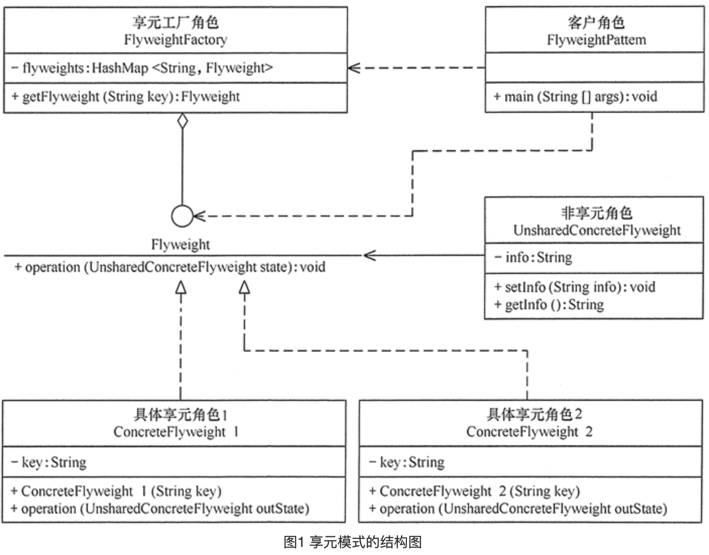

## 享元模式

### 定义

> 运用共享技术来有效地支持大量细粒度对象的复用。它通过共享已经存在的对象来大幅度减少需要创建的对象数量、避免大量相似类的开销，从而提高系统资源的利用率。

### 成员

> 1. 抽象享元角色（Flyweight）：是所有的具体享元类的基类，为具体享元规范需要实现的公共接口，非享元的外部状态以参数的形式通过方法传入。
> 2. 具体享元（Concrete Flyweight）角色：实现抽象享元角色中所规定的接口。
> 3. 非享元（Unsharable Flyweight)角色：是不可以共享的外部状态，它以参数的形式注入具体享元的相关方法中。
> 4. 享元工厂（Flyweight Factory）角色：负责创建和管理享元角色。当客户对象请求一个享元对象时，享元工厂检査系统中是否存在符合要求的享元对象，如果存在则提供给客户；如果不存在的话，则创建一个新的享元对象。

### 使用场景

> 1. 系统中存在大量相似对象
> 2. 需要用到对象池的地方
> 3. 对象没有特定身份
>
> 享元模式通常需要一个工厂类来管理对象的复用 , 所以一般在对象数量较大的时候使用 , 否则没有必要使用享元模式.
>
> 需要注意的是 , 由于是对对象的复用 , 必然会产生线程问题 , 以及效率问题 , 如果注重这两点的话 , 可以不用享元模式.


### UML图




### 代码

> 在Android源码中比较典型的使用就是Handler了  , Android系统的核心是消息驱动 , 你的每一次操作都是一条Message , 如果不停的new Message , 那么对象的数量是极为恐怖的 , 而官方文档中对创建Message的建议测试不要通过new来实现 , 而是通过Handler的`obtainMessage()`方法复用一个Message. 具体源码分析可以阅读<Android源码设计模式解析与实战> , 其对享元模式的灵活运用也是对我们一个很好的启发 , 这里不再赘述.
>
> 这里我们仅做一个简单的示例代码.

```java
public class FlyweightPattern {
    public static void main(String[] args) {
        FlyweightFactory factory = new FlyweightFactory();
        Flyweight f01 = factory.getFlyweight("a");
        Flyweight f02 = factory.getFlyweight("a");
        Flyweight f03 = factory.getFlyweight("a");
        Flyweight f11 = factory.getFlyweight("b");
        Flyweight f12 = factory.getFlyweight("b");
        f01.operation(new UnsharedConcreteFlyweight("第1次调用a。"));
        f02.operation(new UnsharedConcreteFlyweight("第2次调用a。"));
        f03.operation(new UnsharedConcreteFlyweight("第3次调用a。"));
        f11.operation(new UnsharedConcreteFlyweight("第1次调用b。"));
        f12.operation(new UnsharedConcreteFlyweight("第2次调用b。"));
    }
}
//非享元角色
class UnsharedConcreteFlyweight {
    private String info;
    UnsharedConcreteFlyweight(String info) {
        this.info = info;
    }
    public String getInfo() {
        return info;
    }
    public void setInfo(String info) {
        this.info = info;
    }
}
//抽象享元角色
interface Flyweight {
    public void operation(UnsharedConcreteFlyweight state);
}
//具体享元角色
class ConcreteFlyweight implements Flyweight {
  
    private String key;
  
    ConcreteFlyweight(String key) {
        this.key = key;
        System.out.println("具体享元" + key + "被创建！");
    }
    public void operation(UnsharedConcreteFlyweight outState) {
        System.out.print("具体享元" + key + "被调用，");
        System.out.println("非享元信息是:" + outState.getInfo());
    }
}
//享元工厂角色
class FlyweightFactory {
  
    private HashMap<String, Flyweight> flyweights = new HashMap<String, Flyweight>();
  
    public Flyweight getFlyweight(String key) {
        Flyweight flyweight = (Flyweight) flyweights.get(key);
        if (flyweight != null) {
            System.out.println("具体享元" + key + "已经存在，被成功获取！");
        } else {
            flyweight = new ConcreteFlyweight(key);
            flyweights.put(key, flyweight);
        }
        return flyweight;
    }
}
```


### 总结

享元模式的使用重点在于减少相似实体对象的数量 ,  需要注意的是 , 非享元角色是可以不存在的 , 既纯享元模式 , 对于享元模式的使用 , 更多的应该是参考Handler的Message实现 , 作为变种形态 , Message集多种角色与一身 , 更多细节还是看<Android源码设计模式解析与实战>吧 , 对于这一篇的学习 , 无非把书上的内容照搬一遍.

