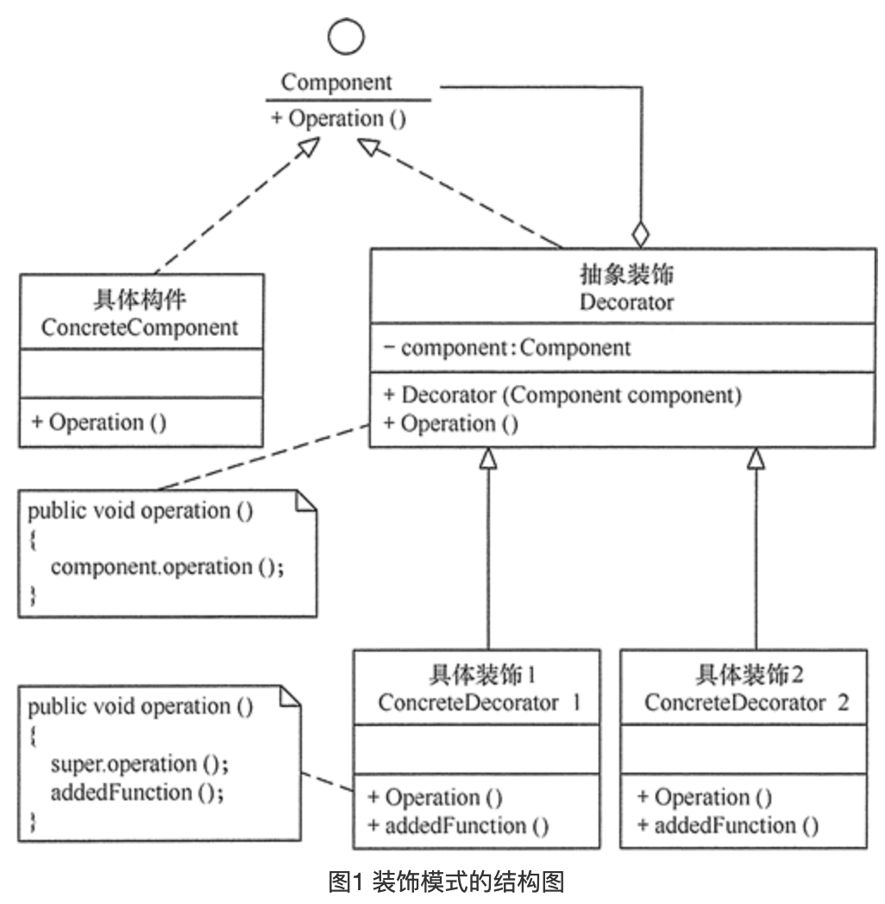

## 装饰模式

### 定义

> 指在不改变现有对象结构的情况下，动态地给该对象增加一些职责（即增加其额外功能）的模式，它属于对象结构型模式。

### 成员

> 1. 抽象构件（Component）角色：定义一个抽象接口以规范准备接收附加责任的对象。
> 2. 具体构件（ConcreteComponent）角色：实现抽象构件，通过装饰角色为其添加一些职责。
> 3. 抽象装饰（Decorator）角色：继承抽象构件，并包含具体构件的实例，可以通过其子类扩展具体构件的功能。
> 4. 具体装饰（ConcreteDecorator）角色：实现抽象装饰的相关方法，并给具体构件对象添加附加的责任。

### 使用场景

> 需要对原始类的功能进行增强.
>
> 当对象的功能需要动态添加和移除.
>
> 某些功能需要继承来完成 , 但又不想为此而强制的增加耦合度.

### UML



### 代码

```java
/**
 * 抽象构件
 */
public interface Component {

    void operation();
}
```

```java
/**
 * 具体构件
 */
public class ConcreteComponent implements Component{
    @Override
    public void operation() {
        System.out.println("具体构建操作");
    }
}
```

```java
/**
 * 具体装饰类
 */
public class ConcreteDecorator extends Decorator{


    public ConcreteDecorator(Component component) {
        super(component);
    }

    @Override
    public void operation() {
        System.out.println("装饰操作开始");
        component.operation();
        System.out.println("装饰操作结束");
    }
}
```

```java
/**
 * 抽象装饰类
 */
public abstract class Decorator implements Component{

    Component component;

    public Decorator(Component component) {
        this.component = component;
    }
}
```

```java
// 创建一个具体构件 , 并执行原始操作
Component component = new ConcreteComponent();
component.operation();

// 创建装饰构件 , 传入具体构件的实例 , 执行装饰后操作
Decorator decorator = new ConcreteDecorator(component);
decorator.operation();
```

> 除此之外 , JAVA的I/O流也是装饰模式的经典案例.

```java
FileReader fileReader = new FileReader("filename.txt");
BufferedReader in = new BufferedReader(fileReader);
String s = in.readLine();
```


### 总结

> 装饰模式的本质其实可以理解为继承的代替方案 , 规避继承的高耦合性 , 在看过实现代码后 , 可能会理解不了代理模式和装饰模式的区别 , 代码层面确实有些相似 , 但是重在意图 , 例如一把菜刀 , 用来切菜就是菜刀 , 用来切人就是砍刀 . 但刀都一模一样 , 如果仔细看前面的代理模式那篇的话 , 装饰模式仅仅跟代理模式的`智能引用`意图相似 , 而有有不同的是 , 智能引用解决的是对方法的批量增强 , 例如统一都要加LOG日志等 , 而装饰模式则意在不改动原始类的情况下对某个或多个方法进行增强. 例如Java的 I/O流 , 就是典型的装饰模式.