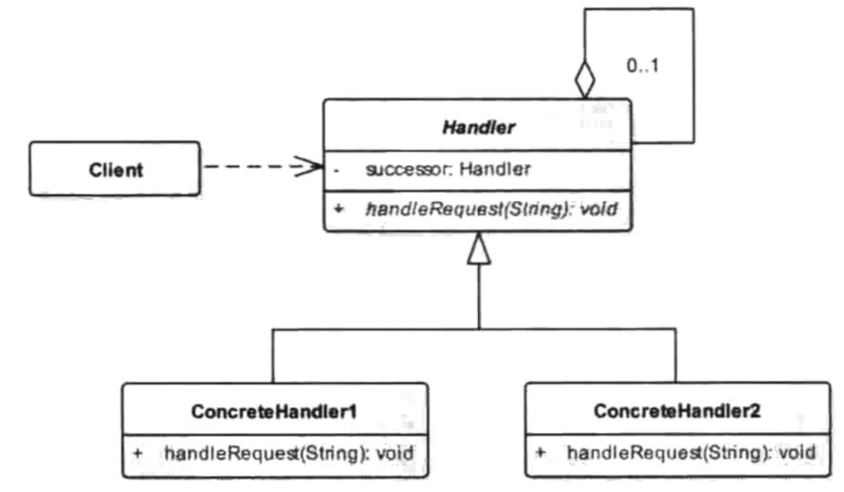

# 责任链模式(职责链模式)

### 定义

> 为了避免请求发送者与多个请求处理者耦合在一起，于是将所有请求的处理者通过前一对象记住其下一个对象的引用而连成一条链；当有请求发生时，可将请求沿着这条链传递，直到有对象处理它为止。

### 成员

> 1. 抽象处理者（Handler）角色：定义一个处理请求的接口，包含抽象处理方法和一个后继连接。
> 2. 具体处理者（Concrete Handler）角色：实现抽象处理者的处理方法，判断能否处理本次请求，如果可以处理请求则处理，否则将该请求转给它的后继者。
> 3. 客户类（Client）角色：创建处理链，并向链头的具体处理者对象提交请求，它不关心处理细节和请求的传递过程。

### 使用场景

> 多个对象处理同一种请求 , 但具体由哪个对象来处理 , 需要动态的决定.
>
> 请求者不知道具体由谁来处理 , 则将请求一个一个提交 , 直至提交到适合处理的对象.
>
> 需要动态请求一组对象来处理请求 , OkHttp的拦截器就是个很好的例子.
>
> **需要注意的是 , 上面三种使用场景 , 前两种和最后一种在代码实现和意图上是有区别的 , 前者最终由链中的某一个对象来处理 , 后者则是每个链中的成员都参与执行.**

### UML



### 代码

> 我们用公司的审批流程做例子 , 同时包含两种使用场景.
>
> 报销 , 需要每一层都签字批准 , 方可发放款项.
>
> 请假 , 不同级别的领导对请假天数的批准权限也不同.

```java
/**
 * 领导接口
 */
public abstract class ILeader {

    public ILeader leader;

    /**
     * 处理报销事务
     * 必须每一层领导都批准才能报销
     * @param funding
     */
    public abstract void handlerForMoney(Funding funding);

    /**
     * 处理休假事务
     * 请假的天数决定了由哪一层批准
     * @param day
     */
    public abstract void handlerForVacation(int day);

}
```

```java
/**
 * 组长
 */
public class LeaderOfGroup extends ILeader{

    @Override
    public void handlerForMoney(Funding funding) {
        funding.sign += "组长签名";
        System.out.println(funding.reason + funding.money + "元 , 组长批准");
        leader.handlerForMoney(funding);
    }

    @Override
    public void handlerForVacation(int day) {
        // 可以处理两天内的请假申请
        if (day <= 2) {
            System.out.println("组长批准休假");
        } else {
            leader.handlerForVacation(day);
        }
    }
}
```

```java
/**
 * 经理
 */
public class LeaderOfGM extends ILeader{

    @Override
    public void handlerForMoney(Funding funding) {
        funding.sign += "经理签名";
        System.out.println(funding.reason + funding.money + "元 , 经理批准");
        leader.handlerForMoney(funding);
    }

    @Override
    public void handlerForVacation(int day) {
        // 可以处理5天内的请假申请
        if (day <= 5) {
            System.out.println("经理批准休假");
        } else {
            leader.handlerForVacation(day);
        }
    }
}
```

```java
/**
 * 老板
 */
public class LeaderOfBoss extends ILeader{

    @Override
    public void handlerForMoney(Funding funding) {
        funding.sign += "老板签名";
        System.out.println(funding.reason + funding.money + "元 , 老板批准");
    }

    @Override
    public void handlerForVacation(int day) {
        // 5天以上的请假申请需要老板同意
        System.out.println("老板批准休假");
    }
}

```

```java
/**
* 客户端
*/
public void main() {
    // 初始化责任链关系
    ILeader boss = new LeaderOfBoss();
    ILeader GM = new LeaderOfGM();
    ILeader group = new LeaderOfGroup();
    group.leader = GM;
    GM.leader = boss;

    // 提交请假
    group.handlerForVacation(3);

    // 提交报销
    Funding funding = new Funding();
    funding.reason = "加班打车";
    funding.money = 70;
    group.handlerForMoney(funding);
    // 财务审批
    if (funding.sign.equals("组长签名经理签名老板签名")) {
      System.out.println("财务发放报销款项");
    } else {
      System.out.println("财务不发放报销款项");
    }
}


/**
 * 经费报销对象
 * 不在设计模式的角色范围内
 */
public class Funding {

    public String reason;

    public int money;

    public String sign = "";

}


// 最终输出
经理批准休假
  
加班打车70元 , 组长批准
加班打车70元 , 经理批准
加班打车70元 , 老板批准
财务发放报销款项
```

### 总结

> 其实在上面的例子中 , 我们在逻辑上固化了责任关系结构 , 其实责任链的精髓在于链式调用的灵活性 , next可以指向任何同类对象 , 而同类对象也可以轻松的利用链的结构任意排列顺序 . 经典实现则可以参考OkHttp拦截器相关的源码.