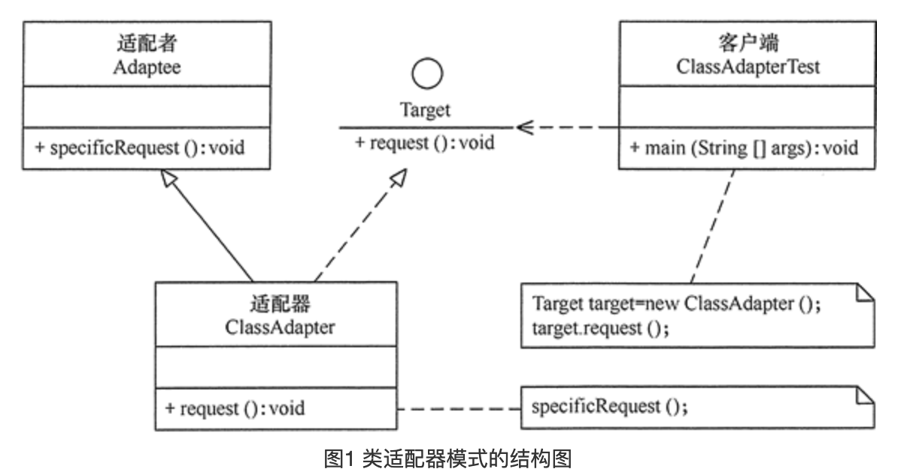
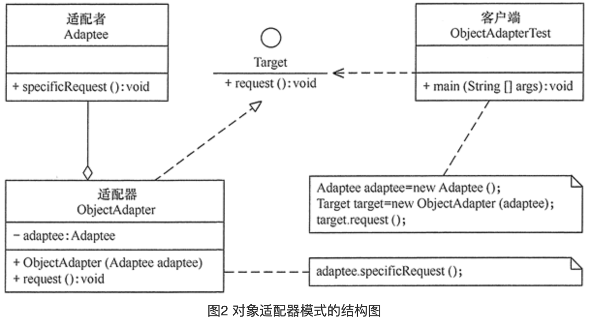

## 适配器模式

### 定义

> 将一个类的接口转换成客户希望的另外一个接口，使得原本由于接口不兼容而不能一起工作的那些类能一起工作。
>
> 适配器模式分为类结构型模式和对象结构型模式两种，前者类之间的耦合度比后者高，且要求程序员了解现有组件库中的相关组件的内部结构，所以应用相对较少些。

### 成员

> 1. 目标（Target）接口：当前系统业务所期待的接口，它可以是抽象类或接口。
> 2. 适配者（Adaptee）类：它是被访问和适配的现存组件库中的组件接口。
> 3. 适配器（Adapter）类：它是一个转换器，通过继承或引用适配者的对象，把适配者接口转换成目标接口，让客户按目标接口的格式访问适配者。

### 使用场景

> 使原本不兼容的接口融合在一起 , 使之能更好的在一起工作 , 例如我们实际生活中的电源适配器 / 转换接头等等 ;
>
> 同时也可以抽象出变化部分 , 通过Adapter来隔离变化 , 例如ListView中的Adapter.

### UML





### 代码

**类适配器**

```java
//目标接口
interface Target{
    public void request();
}
//适配者接口
class Adaptee
{
    public void specificRequest(){       
        System.out.println("适配者中的业务代码被调用！");
    }
}
//类适配器类
class Adapter extends Adaptee implements Target
{
    public void request(){
        specificRequest();
    }
}
//客户端代码
public class Test
{
    public static void main(String[] args){
        Target target = new Adapter();
        target.request();
    }
}
```

**对象适配器**

```java
//目标接口
interface Target{
    public void request();
}

//适配者接口
class Adaptee{
    public void specificRequest(){       
        System.out.println("适配者中的业务代码被调用！");
    }
}

//对象适配器类
class Adapter implements Target{
  
    private Adaptee adaptee;
  
    public Adapter(Adaptee adaptee){
        this.adaptee=adaptee;
    }
  
    public void request(){
        adaptee.specificRequest();
    }
}

//客户端代码
public class Test{
  
    public static void main(String[] args){
        System.out.println("对象适配器模式测试：");
        Adaptee adaptee = new Adaptee();
        Target target = new Adapter(adaptee);
        target.request();
    }
}
```

### 总结

> 适配器模式相对简单 , 例如两个模块 , 都能正常运行,  但现在需要将连个模块关联起来 , 可其中一些接口又都对不上 , 就可以新增一个Adapter类 , 来完成他们之间的连接 , A模块依然可以跟之前一样正常调用方法 , B模块亦然 , 说道这里 , 就还得扩展一个`双向适配器`了 , 具体的实现就是在适配器中同时存在A转B和B转A两个方法 , 使得可以通过适配器完成双向调用.