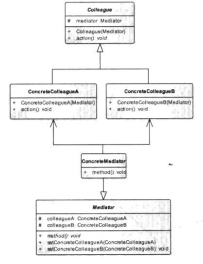

# 中介模式

### 定义

> 定义一个中介对象来封装一系列对象之间的交互，使原有对象之间的耦合松散，且可以独立地改变它们之间的交互。中介者模式又叫调停模式，它是迪米特法则的典型应用。

### 成员

> 1. 类之间各司其职，符合迪米特法则。
> 2. 降低了对象之间的耦合性，使得对象易于独立地被复用。
> 3. 将对象间的一对多关联转变为一对一的关联，提高系统的灵活性，使得系统易于维护和扩展。

### 应用场景

> 将相互依赖调用的网状对象关系整合到中介类中. 使之变为星型关系结构.
>
> 对象间需要频繁调用 , 且调用关系复杂.

### UML



### 代码

> 在实际项目中 , 如果没有项目经理的协调 , 会出现这种情况:
>
> 营销需要一个新功能 , 找到了程序员 ;
> 程序员再去找UI要设计图;
> UI做好让营销看合不合适;
> 程序员拿到设计图开始撸码.
> 营销根据UI图又改了一版 , 但没有通知到程序员;
> 此时代码已经提交到测试那 , 然后测试找UI要设计图对照功能;
> 但是他拿到的是最新的图 , 程序员是按照老需求做的;
> 然后....
>
> 那么我们把这些错综复杂的依赖关系都丢给项目经理处理 , 任何同事间的工作都由他调度. 任何一端发生了变化 , 都无需再依次通知其他对象 , 仅需要告诉项目经理就行了.

```java
/**
 * 项目经理抽象类
 * 抽象 Mediator 类
 */
public abstract class IProjectMediator {

    // 持有一个团队 程序员  测试  UI设计师
    protected IColleague coder , test , ui;

    public IProjectMediator() {
        coder = new Coder(this);
        test = new Test(this);
        ui = new UI(this);
    }

    /**
     * 开始做一个新功能
     */
    public abstract void newFunction();

    /**
     * 其他同事完成了工作要通知他
     * @param colleague 用来表示谁完成了工作
     */
    public abstract void hasResult(IColleague colleague);
}
```

```java
/**
 * 项目经理
 * 具体 Mediator 类
 */
public class ProjectGM extends IProjectMediator{


    @Override
    public void hasResult(IColleague colleague) {
        if (colleague instanceof Coder) {
            test.working();
        } else if (colleague instanceof UI) {
            // todo 做一些检查UI是否合格的验证
            coder.working();
        } else if (colleague instanceof Test) {
            // todo 如果BUG太多重新调用Coder的working方法
            System.out.println("功能完成");
        }
    }

    @Override
    public void newFunction() {
        // 新需求来了先让UI设计
        // todo 可以根据需求的轻重缓急选择是否暂停正在做的功能.
        ui.working();
    }
}

```

```java
/**
 * 抽象同事类
 * Colleague
 */
public abstract class IColleague {

    // 持有一个项目经理对象
    IProjectMediator projectMediator;

    public IColleague(IProjectMediator projectMediator) {
        this.projectMediator = projectMediator;
    }

    /**
     * 开始工作
     */
    public abstract void working();

    /**
     * 完成工作
     */
    public abstract void finishWork();
}
```

```java
/**
 * 具体 Colleague 类
 *  码农
 */
public class Coder extends IColleague {

    public Coder(IProjectMediator projectMediator) {
        super(projectMediator);
    }

    @Override
    public void working() {
        System.out.println("编码中...");
        finishWork();
    }

    @Override
    public void finishWork() {
        System.out.println("提交代码");
        projectMediator.hasResult(this);
    }
}

// UI设计
public class UI extends IColleague{

    public UI(IProjectMediator projectMediator) {
        super(projectMediator);
    }

    @Override
    public void working() {
        System.out.println("切图中...");
        finishWork();
    }

    @Override
    public void finishWork() {
        System.out.println("提供UI设计图");
        projectMediator.hasResult(this);
    }
}

// 测试
public class Test extends IColleague{
    public Test(IProjectMediator projectMediator) {
        super(projectMediator);
    }
  
    @Override
    public void working() {
        System.out.println("测试中...");
        finishWork();
    }

    @Override
    public void finishWork() {
        System.out.println("提交测试结果");
        projectMediator.hasResult(this);
    }
}

```

```java
/**
 * 营销部或老板
 */
public void main() {
    IProjectMediator projectMediator = new ProjectGM();
    projectMediator.newFunction();
}

// 运行结果
切图中...
提供UI设计图
编码中...
提交代码
测试中...
提交测试结果
功能完成
```

### 总结

> 中介模式在运用的时候需要注意中介类的复杂度 , 如果设计不当会造成中介类过于臃肿 .
>
> 为了开发更简单 , 可以不要抽象中介类 , 而是将中介定义为单例 , 同事类仅在需要调用的时候获取.

