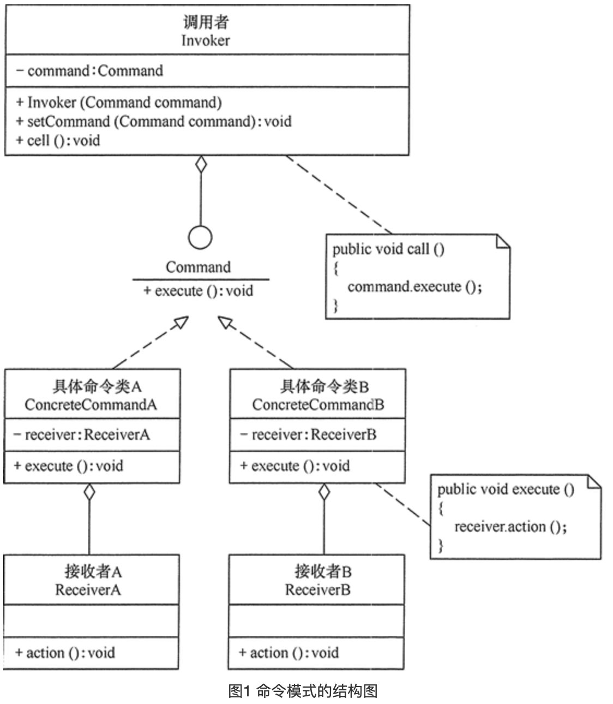

# 命令模式

### 定义

> 将一个请求封装为一个对象，使发出请求的责任和执行请求的责任分割开。

### 成员

> 1. 抽象命令类（Command）角色：声明执行命令的接口，拥有执行命令的抽象方法 execute()。
> 2. 具体命令类（Concrete Command）角色：是抽象命令类的具体实现类，它拥有接收者对象，并通过调用接收者的功能来完成命令要执行的操作。
> 3. 实现者/接收者（Receiver）角色：执行命令功能的相关操作，是具体命令对象业务的真正实现者。
> 4. 调用者/请求者（Invoker）角色：是请求的发送者，它通常拥有很多的命令对象，并通过访问命令对象来执行相关请求，它不直接访问接收者。

### 使用场景

> 需要对操作记录日志 , 以便在某个时间点重新执行这一系列命令.
>
> 支持撤销操作的功能 , 例如画板.
>
> 具体操作和创建该操作的对象生命周期无关 , 例如你告诉某人 , 有空了给XXX回个电话.

### UML



### 代码

```java
package command;

public class CommandPattern {
    public static void main(String[] args) {
        Command cmd = new ConcreteCommand();
        Invoker ir = new Invoker(cmd);
        System.out.println("客户访问调用者的call()方法...");
        ir.call();
    }
}

//调用者
class Invoker {
    private Command command;

    public Invoker(Command command) {
        this.command = command;
    }

    public void setCommand(Command command) {
        this.command = command;
    }

    public void call() {
        System.out.println("调用者执行命令command...");
        command.execute();
    }
}

//抽象命令
interface Command {
    public abstract void execute();
}

//具体命令
class ConcreteCommand implements Command {
    private Receiver receiver;

    ConcreteCommand() {
        receiver = new Receiver();
    }

    public void execute() {
        receiver.action();
    }
}

//接收者
class Receiver {
    public void action() {
        System.out.println("接收者的action()方法被调用...");
    }
}
```


### 总结

> 命令模式的类增长非常多 , 因为他的思想就是将方法封装成类 , 而他的变种我觉得是个不错的方式 , 例如Runnabal , 他更像是一个回调 , 将接收者变为了任何方法 , 同时又满足了延迟执行或记录操作等. 