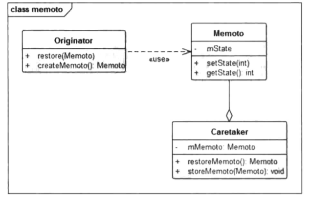

# 备忘录模式(快照模式)-Memento

### 定义

> 在不破坏封装性的前提下，捕获一个对象的内部状态，并在该对象之外保存这个状态，以便以后当需要时能将该对象恢复到原先保存的状态。
>
> 需要保证被保存对象的状态不能通过外部访问 , 从而保护被保存对象的状态的完整性以及内部实现不对外暴露.

### 成员

> 1. 发起人（Originator）角色：负责创建一个备忘录 , 可以记录/恢复自身的内部状态 , 同时还可以通过Memento决定记录哪部分状态.
> 2. 备忘录（Memento）角色：用于记录Originator的内部状态 , 同时还能防止除他以外的其他对象访问Memento.
> 3. 管理者（Caretaker）角色：负责存储备忘录 , 但不能对备忘录的内容进行操作和访问 , 用于将备忘录传递给其他对象.

### 使用场景

> 保存一个对象在某一时刻的状态或部分状态.

### UML



### 代码

> 

```java
// Client
public void main() {
        // 创建游戏类
        Game game = new Game();
        // 创建存档管理类
        Caretaker caretaker = new Caretaker();
        // 开始游戏 , 然后退出
        game.startGame();
        game.quit();
        // 退出后保存游戏进度
        caretaker.setMemento(game.createMemento());

        // 接着玩儿 , 需要恢复进度
        game.restoreGame(caretaker.getMemento());
        game.startGame();
}
```

```java
/**
 * Memento类
 */
public class GameMemento {

    // 生命值
    private int HP;
    // 魔法值
    private int MP;
    // 经验值
    private int EXP;

    // ... 省略get / set 方法...
}
```

```java
/**
 * 管理者
 * 用于管理Memento
 */
public class Caretaker {

    private GameMemento memento;

    public GameMemento getMemento() {
        // todo 可以从各种存储上读取这个Memento , 例如数据库中
        return memento;
    }

    public void setMemento(GameMemento memento) {
        this.memento = memento;
        // todo 可以做持久化存储
    }
}
```

```java
/**
 * 游戏类
 */
public class Game {

    // 生命值
    private int HP = 100;
    // 魔法值
    private int MP = 100;
    // 经验值
    private int EXP = 0;

    /**
     * 开始游戏
     */
    public void startGame() {
        System.out.println("游戏开始");
        HP--;
        MP--;
        EXP++;
    }

    /**
     * 退出游戏
     * 同时保存当前的进度
     */
    public void quit() {
        System.out.println("游戏结束");
    }

    /**
     * 创建一个新的进度
     * @return
     */
    public GameMemento createMemento() {
        GameMemento memento = new GameMemento();
        memento.setHP(this.HP);
        memento.setMP(this.MP);
        memento.setEXP(this.EXP);
        return memento;
    }

    /**
     * 恢复上次进度
     * @param memento
     */
    public void restoreGame(GameMemento memento) {
        this.HP = memento.getHP();
        this.MP = memento.getMP();
        this.EXP = memento.getEXP();
    }
}
```

### 总结

> 备忘录模式比较偏应用层 , 使用也非常简单 , 无非就是对发起人的部分或全部属性进行记录.
>
> 如果引入`原型模式` , 则可以省略备忘录角色 , 需要记录时 , 直接使用clone来复制发起者.