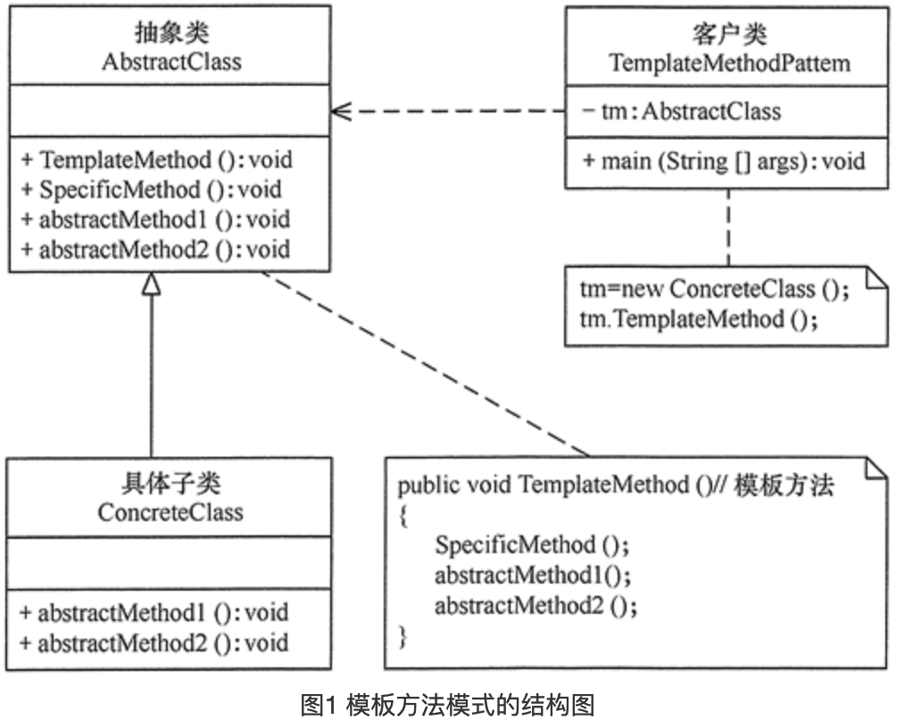

# 模板方法模式

### 定义

> 定义一个操作中的算法骨架，而将算法的一些步骤延迟到子类中，使得子类可以不改变该算法结构的情况下重定义该算法的某些特定步骤。它是一种类行为型模式。

### 成员

> 1. **抽象类/抽象模板（Abstract Class）**: 抽象模板类，负责给出一个算法的轮廓和骨架。它由一个**模板方法**和若干个**基本方法**构成。这些方法的定义如下。
>
>    模板方法：定义了算法的骨架，按某种顺序调用其包含的基本方法。
>    基本方法：是整个算法中的一个步骤，包含以下几种类型。
>    抽象方法：在抽象类中声明，由具体子类实现。
>    具体方法：在抽象类中已经实现，在具体子类中可以继承或重写它。
>    钩子方法：在抽象类中已经实现，包括用于判断的逻辑方法和需要子类重写的空方法两种。钩子方法和抽象方法不同的是 , 钩子方法可以选择性的被实现.
>
> 2. **具体子类/具体实现（Concrete Class）**: 具体实现类，实现抽象类中所定义的抽象方法和钩子方法，它们是一个顶级逻辑的一个组成步骤。

### 使用场景

> 整体算法很固定 , 只有部分变化 , 可以将部分抽出来 , 例如起床 , 吃饭 , 工作 , 睡觉 , 其中工作就是一个不固定的部分.
>
> Android的生命周期回调就是一个很好的例子 , 将不确定的部分派发给子类实现或重写.

### UML



### 代码

```java
// Client
public class TemplateMethodPattern {
    public static void main(String[] args) {
        AbstractClass tm = new ConcreteClass();
        tm.TemplateMethod();
    }
}

//抽象类
abstract class AbstractClass {
    //模板方法
    public void TemplateMethod() {
        SpecificMethod();
        abstractMethod1();
        abstractMethod2();
    }

    //具体方法
    public void SpecificMethod() {
        System.out.println("抽象类中的具体方法被调用...");
    }

    //抽象方法1
    public abstract void abstractMethod1();

    //抽象方法2
    public abstract void abstractMethod2();
}

//具体子类
class ConcreteClass extends AbstractClass {
    public void abstractMethod1() {
        System.out.println("抽象方法1的实现被调用...");
    }

    public void abstractMethod2() {
        System.out.println("抽象方法2的实现被调用...");
    }
}
```

### 总结

> 模板方法比较好理解 , Android中AsyncTask和Activity等都是模板方法的真实案例 , 但这里需要主要的一点是我们要明白模板方法模式比较偏向于框架的编写 , 子类的不同部分千奇百怪 , 如果仅仅因为不同部分有多种写法而去使用这种模式有点得不偿失 .
>
> 同时需要注意的是 , 如果子类的运行结果会影响父类, 那么尽量避免 , 这在后期的代码阅读及维护上都是噩梦般的存在. 这点我之前就深受其害...