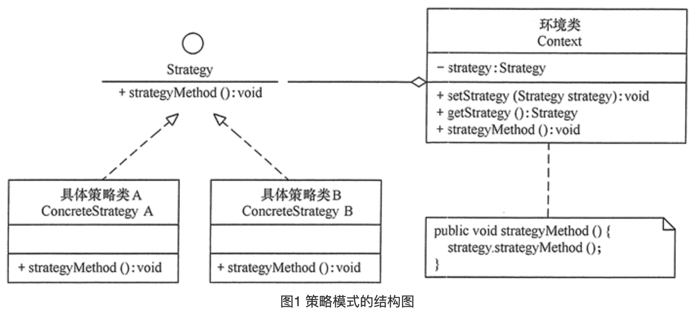

# 策略模式


### 定义

> 该模式定义了一系列算法，并将每个算法封装起来，使它们可以相互替换，且算法的变化不会影响使用算法的客户。

### 成员

> 1. 抽象策略（Strategy）类：定义了一个公共接口，各种不同的算法以不同的方式实现这个接口，环境角色使用这个接口调用不同的算法，一般使用接口或抽象类实现。
> 2. 具体策略（Concrete Strategy）类：实现了抽象策略定义的接口，提供具体的算法实现。
> 3. 环境（Context）类：持有一个策略类的引用，最终给客户端调用。

### 使用场景

> 需要传入不同的算法来完成不同的效果 .
>
> 如果多个行为操作存在于你的if-else中 , 可以用策略模式替代.
>
> 可以动态的切换算法.
>
> RecyclerView中的setLayoutManager()方法则是一个很好的例子.

### UML



### 代码

> 我们来做一个可以纵向布局和随机布局的控件 , 为了控制代码量 , 以下为伪代码 .

**Client**

```java
		// Client
    public void main() {
        ListView listView = new ListView();
        // 使用线性布局策略添加控件
        listView.setLayoutManager(new LinearLayoutManager());
        listView.addView(new TextView(null));
        listView.addView(new TextView(null));

        // 使用随机布局策略添加控件
        listView.setLayoutManager(new RandomLayoutManager());
        listView.addView(new TextView(null));
        listView.addView(new TextView(null));
    }
```

**抽象策略 Strategy**

```java
public abstract class ILayoutManager {

    private int XY[];

    // 用于获取下一个控件的位置
    public abstract int[] getNextViewLocation(View itemView);
}
```

**具体策略 Concrete Strategy**

```java
// 纵向线性布局
public class LinearLayoutManager extends ILayoutManager{

    // 用于记录是第几个View
    int index = 0;

    @Override
    public int[] getNextViewLocation(View itemView) {
        // 每次X轴都为0 , Y轴增加 index * View高度的距离
        return new int[]{0 , itemView.getHeight() * index++};
    }
}


// 随机布局
public class RandomLayoutManager extends ILayoutManager{

    private Random random = new Random();

    @Override
    public int[] getNextViewLocation(View itemView) {
        ViewGroup viewGroup = (ViewGroup) itemView.getParent();
        int width = viewGroup.getWidth();
        int height = viewGroup.getHeight();
        return new int[]{random.nextInt(width) , random.nextInt(height)};
    }
}
```

**环境类 Context**

```java
public class ListView {

    // 持有一个策略实例
    ILayoutManager layoutManager;

    public void setLayoutManager(ILayoutManager layoutManager) {
        this.layoutManager = layoutManager;
    }

    public void addView(View view) {
        // 在每次添加控件的时候调用策略的具体实现获取 X Y 坐标.
        int[] nextViewLocation = layoutManager.getNextViewLocation(view);
        view.setX(nextViewLocation[0]);
        view.setY(nextViewLocation[1]);
    }

}
```

### 总结

> 策略模式主要用于抽离算法 , 接口及意图都相对简单 , 若策略较多 , 可以加入工厂类来统一管理策略 .