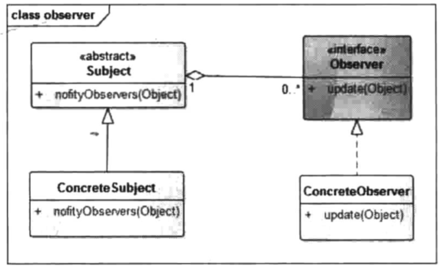

# 观察者模式(发布-订阅模式)

### 定义

> 指多个对象间存在一对多的依赖关系，当一个对象的状态发生改变时，所有依赖于它的对象都得到通知并被自动更新。这种模式有时又称作发布-订阅模式、模型-视图模式，它是对象行为型模式。

### 成员

> 1. 抽象主题（Subject）角色：也叫抽象目标类，它提供了一个用于保存观察者对象的聚集类和增加、删除观察者对象的方法，以及通知所有观察者的抽象方法。
> 2. 具体主题（Concrete Subject）角色：也叫具体目标类，它实现抽象目标中的通知方法，当具体主题的内部状态发生改变时，通知所有注册过的观察者对象。
> 3. 抽象观察者（Observer）角色：它是一个抽象类或接口，它包含了一个更新自己的抽象方法，当接到具体主题的更改通知时被调用。
> 4. 具体观察者（Concrete Observer）角色：实现抽象观察者中定义的抽象方法，以便在得到目标的更改通知时更新自身的状态。

### 应用场景

> 一些对象需要根据数据的变化 , 做出对应的反应.
>
> 解耦对象与变化数据间的关系.
>
> 使事件具有跨域能力.

### UML



### 代码

> 因为JAVA已经提供了一个非常好的观察者模式实现 , 这里我们用java提供的框架来代替抽象主题和抽象观察者.
>
> 我们模拟一个新年倒计时 , 观众们看着巨幅秒表10 9 8...3 2 1的过程 .

```java
/**
 * Observable担任了抽象主题
 * NewYearCountdown为具体主题
 */
public class NewYearCountdown extends Observable {

    // 开始倒计时
    public void start() throws InterruptedException {
        for (int i = 10; i > 0; i--) {
            // 在调用notify方法时先标记数据发生了改变 , 否则不会有任何反应
            setChanged();
            // 将剩余时间通知给所有观察者
            notifyObservers(i);
            Thread.sleep(1000);
        }
    }
}
```

```java
/**
 * Observer担任抽象观察者
 * Audience担任具体观察者
 */
public class Audience implements Observer {

    // 需要实现update方法
    @Override
    public void update(Observable o, Object arg) {
        // 喊出倒计时
        System.out.println(arg);
    }

}
```

```java
/**
* 客户端
*/
public void main() throws InterruptedException {
    final NewYearCountdown countdown = new NewYearCountdown();
    Audience audience = new Audience();
    countdown.addObserver(audience);
    countdown.start();
}
```

### 总结

> 观察者模式是实际开发中使用比较频繁的模式之一 , 在使用观察者模式的时候 , 同样需要注意线程安全问题 , 例如在notify过程中增加或删除观察者等问题需要考虑进去 , 而在JAVA中可以轻松的使用Observable和Observer来实现观察者模式 , 并且已经解决了线程安全问题 , 具体细节可以参考源码 .