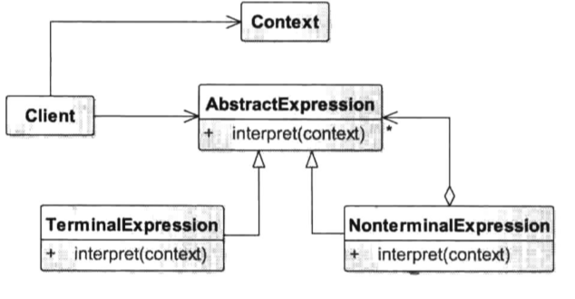
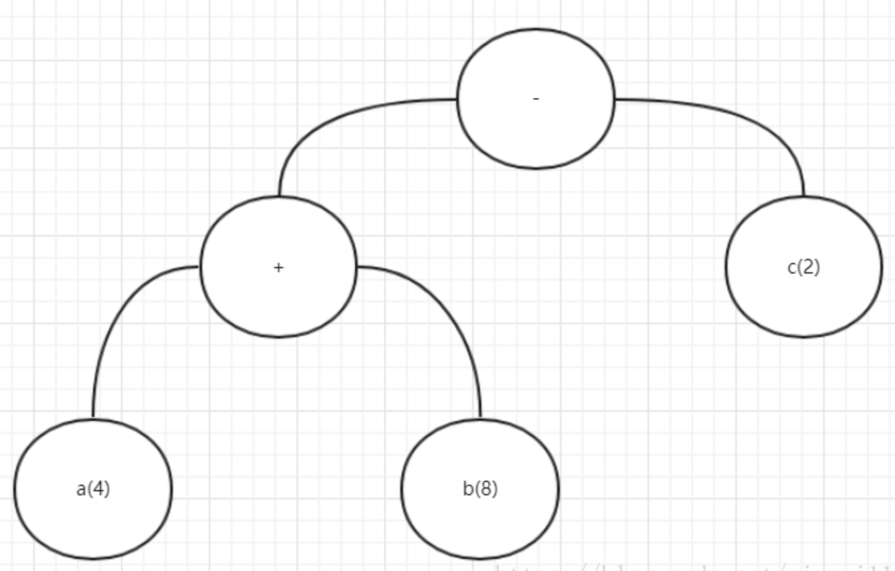

# 解释器模式

### 定义

> 给分析对象定义一个语言，并定义该语言的文法表示，再设计一个解析器来解释语言中的句子。也就是说，用编译语言的方式来分析应用中的实例。

### 成员

> 1. 抽象表达式（Abstract Expression）角色：定义解释器的接口，约定解释器的解释操作，主要包含解释方法 interpret()。
> 2. 终结符表达式（Terminal Expression）角色：是抽象表达式的子类，用来实现文法中与终结符相关的操作，文法中的每一个终结符都有一个具体终结表达式与之相对应。
> 3. 非终结符表达式（Nonterminal Expression）角色：也是抽象表达式的子类，用来实现文法中与非终结符相关的操作，文法中的每条规则都对应于一个非终结符表达式。
> 4. 环境（Context）角色：通常包含各个解释器需要的数据或是公共的功能，一般用来传递被所有解释器共享的数据，后面的解释器可以从这里获取这些值。
> 5. 客户端（Client）：主要任务是将需要分析的句子或表达式转换成使用解释器对象描述的抽象语法树，然后调用解释器的解释方法，当然也可以通过环境角色间接访问解释器的解释方法。

### 使用场景

> 1. 当语言的文法较为简单，且执行效率不是关键问题时。
> 2. 当问题重复出现，且可以用一种简单的语言来进行表达时。
> 3. 当一个语言需要解释执行，并且语言中的句子可以表示为一个抽象语法树的时候，如 XML 文档解释。

### UML



### 代码

> 但凡提到解释器模式 , 就拿计算器的1 + 2 + 3来举例 , 这里就不再赘述 , 为了便于理解 , 我们从其他角度来设计一个例子.
>
> 我们来做一个简易版的Android布局字符串 , 根据传入的字符串生成一个布局 , 就像你用XML写布局一样.
> 例如: 我们传入一个"LinearLayout - TextView ; Button" , 则会生成一个LinearLayout下包含一个TextView和一个Button , 而"LinearLayout下包含一个TextView和一个Button"这句话我们将其文法抽出来 , 得到如下表达式.
>
> 布局 ::= <viewGroup>-<view\*>-<view>;<view\*>;
> "-" : 包含(Contain)
> ";" : 分割同一层级下的多个view , 可以看做和(And)
> "*" : 星 , 表示可以重复无数次.

```java
// Client
@Override
protected void onCreate(Bundle savedInstanceState) {
    super.onCreate(savedInstanceState);
    setContentView(R.layout.activity_main);
    // 创建环境变量类
    Layout layout = new Layout(this);
    // 调用analysis方法创建布局
    ViewGroup analysis = 
          (ViewGroup) layout.analysis("LinearLayout - TextView ; LinearLayout - Button");
    // Log打印....
    strBuilder.append("layout : \n\t");
    traversal(analysis);
    Log.i("Test", strBuilder.toString());
}

// ---------- 格式化打印log , 不重要 -----------
StringBuilder strBuilder = new StringBuilder();
int _t = 0;
void traversal(ViewGroup group) {
      _t+=2;
      strBuilder.append(group.getClass().getName());
      strBuilder.append("\n"+new String(new char[_t]).replace("\0" , "\t")+"|___");
      for (int i = 0; i < group.getChildCount(); i++) {
          View childAt = group.getChildAt(i);
          if (childAt instanceof ViewGroup) {
            traversal((ViewGroup) childAt);
          } else {
            strBuilder.append(childAt.getClass().getName());
            strBuilder.append("\n"+new String(new char[_t]).replace("\0" , "\t")+"|___");
          }
      }
}
//运行结果输出
    	android.widget.LinearLayout
    		|___android.widget.TextView
    		|___android.widget.LinearLayout
    				|___android.widget.Button
```

```java
/**
 * 抽象表达式
 */
public abstract class AbsExpression {

    // 每个表达式都包含左边和右边
    View leftView;
    View rightView;
    public void setView(View leftView, View rightView) {
        this.leftView = leftView;
        this.rightView = rightView;
    }

    // 非终结表达式需要提供的interpret方法
    public abstract View interpret();
}
```

```java
/**
 * 非终结符表达类 "包含"
 */
public class ContainExpression extends AbsExpression{

    @Override
    public View interpret() {
        // 包含逻辑leftView必须是ViewGroup
        if (!(leftView instanceof ViewGroup)) {
            throw new RuntimeException("非ViewGroup不能包含其他View");
        }
        ((ViewGroup) leftView).addView(rightView);
        return leftView;
    }
}

/**
 * 非终结表达式 "和"
 */
public class AndExpression extends AbsExpression{

    @Override
    public View interpret() {
        // leftView不用必须是ViewGroup , 意思是和谁是同一个父控件
        ViewGroup viewGroup = (ViewGroup) leftView.getParent();
        viewGroup.addView(rightView);
        return viewGroup;
    }
}
```

```java
/**
 * 终结符表达类
 * View , 这里我们就直接用原生的控件了.
 */
public class ViewExpression extends AbsExpression {

    View view;

    public ViewExpression(View view) {
        this.view = view;
    }

    @Override
    public View interpret() {
        return view;
    }
}
```

```java
/**
 * 环境类
 */
public class Layout {

    // ---- 这里可以看做一个配置文件 , 不重要 ----
    HashMap<String, Class> viewKey;
    Context context;
    public Layout(Context context) {
        this.context = context;
        viewKey = new HashMap<>();
        viewKey.put("LinearLayout", LinearLayout.class);
        viewKey.put("TextView", TextView.class);
        viewKey.put("Button", Button.class);
    }
    // --------------------------------------

    /**
     * 这个方法为解析入口
     *
     * @param str 需要被解析的字符串
     * @return 返回一个解析为布局的根View
     */
    public View analysis(String str) {
        // 环境类有一个职责就是存放表达式需要的共享数据
        // 用来记录解析到的非终结表达式
        AbsExpression expression = null;
        // 用来记录终结表达式 , 左边和右边
        View leftView = null, rightView;
        // 最后要返回这个rootView
        View rootView = null;
        // 这里用空格拆分字符串
        String[] s = str.split(" ");
        for (int i = 0; i < s.length; i++) {
            switch (s[i]) {
                case "-":
                    // 如果是包含 , 创建包含表达式
                    expression = new ContainExpression();
                    break;
                case ";":
                    // 如果是"和" , 创建"和"表达式
                    expression = new AndExpression();
                    break;
                default:
                    // 如果用于记录的leftView是null , 则记录leftView.
                    if (leftView == null) {
                        leftView = getView(s[i]);
                        rootView = leftView;
                    } else {
                        // 否则将left right传入对应的非终结表达式
                        rightView = getView(s[i]);
                        expression.setView(leftView, rightView);
                        expression.interpret();
                        // 最后left = right
                        leftView = rightView;
                    }
                    break;
            }
        }
        return rootView;
    }

    // 通过反射创建对应View , 不重要
    private View getView(String viewType) {
        Class viewClass = viewKey.get(viewType);
        Constructor d = viewClass.getDeclaredConstructor(new Class[]{Context.class});
        return (View) d.newInstance(new Object[]{context});
    }
}
```

### 总结

> 解释器模式应用还是比较广泛的 , 计算器，正则表达式，控制器，浏览器将前端文件转变为页面等.
>
> 但需要注意的是文法一定要简单才适用于解释器模式 , 否则后期维护将成为问题.
>
> 解释器最主要的就是非终结表达式和终结表达式 , 文法则也是由这两个元素构成的 , 遇到终结表达式则返回 , 遇到非终结表达式则继续解析.
>
> 解释器模式和组合模式相似 , 不同的是 , 解释器模式是对语法书的解析 , [这篇文章](https://blog.csdn.net/niunai112/article/details/79982712)可以参考 . 
>
> 


