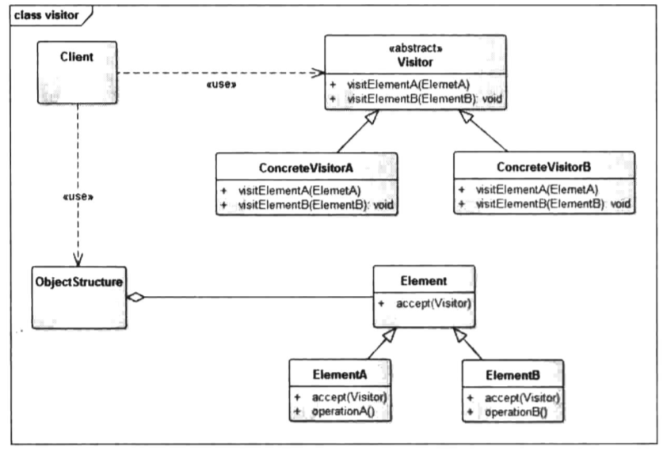

# 访问者模式

### 定义

> 将作用于某种数据结构中的各元素的操作分离出来封装成独立的类，使其在不改变数据结构的前提下可以添加作用于这些元素的新的操作，为数据结构中的每个元素提供多种访问方式。
>
> 访问者模式是23中设计模式中最复杂的一个 , 大多数情况下 , 你不需要使用访问者模式 , 但是当你一旦需要使用它时 , 那你就是真的需要使用它了.

### 成员

> 1. 抽象访问者（Visitor）角色：定义一个访问具体元素的接口，为每个具体元素类对应一个访问操作 visit() ，该操作中的参数类型标识了被访问的具体元素。
> 2. 具体访问者（ConcreteVisitor）角色：实现抽象访问者角色中声明的各个访问操作，确定访问者访问一个元素时该做什么。
> 3. 抽象元素（Element）角色：声明一个包含接受操作 accept() 的接口，被接受的访问者对象作为 accept() 方法的参数。
> 4. 具体元素（ConcreteElement）角色：实现抽象元素角色提供的 accept() 操作，其方法体通常都是 visitor.visit(this) ，另外具体元素中可能还包含本身业务逻辑的相关操作。
> 5. 对象结构（Object Structure）角色：是一个包含元素角色的容器，提供让访问者对象遍历容器中的所有元素的方法，通常由 List、Set、Map 等聚合类实现。

### 应用场景

> 对统一对象或数据源 , 存在多种不同处理方式的访问者 .
>
> 数据源对象跟访问者间的关系结构比较固定 , 否则不适用.

### UML



### 代码

> 对于同一台电脑 , 每个人访问的需求是不同的 , 玩家用来打游戏 , 程序员用来敲代码 , 运营用来写软文...
>
> 如果将这些判断都放在电脑端 , 那么需要做N多if-else , 并且再来一个财务用来做表格 , 那就需要修改电脑类 , 违反了开闭原则 .
>
> 那么下面我们来开一间网吧 , 来满足不同职业的顾客需求.

```java
/**
 * 抽象访问者
 *
 * 顾客抽象类
 */
public interface IVisitor {

    void visitor(IComputer computer);

}
```

```java
/**
 * 具体访问者
 *
 * 具体的顾客类 , 这是一个码农
 */
public class Coder implements IVisitor {

    @Override
    public void visitor(IComputer computer) {
        System.out.println("Coder open the " + computer.software.get("Coding"));
    }
}

/**
 * 同样的 这是一个游戏玩家
 */
public class Player implements IVisitor {

    @Override
    public void visitor(IComputer computer) {
        System.out.println("Player open the " + computer.software.get("Playing"));
    }
}
```

```java
/**
 * 抽象元素类
 * 抽象电脑类
 */
public abstract class IComputer {

    /**
     * 提供一个accept方法  允许访问者访问
     * @param IVisitor 访问者
     */
    public abstract void accept(IVisitor IVisitor);
  
  
   // 软件集合
    HashMap<String, String> software;
    public IComputer() {
        // 为了减少代码量 , 这里不再提供通过外部调用添加软件的方法 , 直接初始化
        software = new HashMap<>();
        software.put("Coding", "AndroidStudio");
        software.put("Playing", "GTA5");
    }
}
```

```java
/**
 * 具体元素类
 * 一台windows的电脑
 * 实现抽象元素类
 */
public class WindowsComputer extends IComputer{

    @Override
    public void accept(IVisitor visitor) {
        visitor.visitor(this);
    }
}
```

```java
/**
 * 对象结构类
 * 网吧类
 */
public class InternetClub {

    ArrayList<IComputer> list = new ArrayList<>();

    public InternetClub() {
        // 添加3台机器
        list.add(new WindowsComputer());
        list.add(new WindowsComputer());
        list.add(new WindowsComputer());
    }

    // 提供一个访问方法 , 类似于吧台
    public void accept(IVisitor visitor) {
        // 如果没有空余机器则直接输出
        if (list.size() == 0) {
            System.out.println("没机器了...");
            return;
        }
        // 如果有空余机器则从list中移除一台空余机器分配给使用者
        IComputer spareComputer = list.remove(list.size() - 1);
        spareComputer.accept(visitor);
        // todo 我们就不再写下机操作了...
    }
}
```

### 总结

> 我们来总结下上面的例子 .
>
> `Computer`就是元素 , 我个人理解为被访问者 , `Coder`和`Player`则是访问者 , `InternetClub`则是对象结构类 , 他抽象出了他们之间的关系结构 , 在`accept`方法中 .
>
> 元素类即被访问者 , 都会提供一个`accept(Visitor v)`方法 , 在这个方法需要传入一个访问者 , 然后调用访问者的`visitor(Element e)`方法 , 这里其实相当于相互告知身份的过程.
>
> 最后 , 在访问者的`visitor()`方法中执行对被访问者的实际操作 , 这里不同访问者对被访问者即元素的关注点和操作是多样化的.
>
> 该模式最大的有点就是对访问者的扩展非常方便. 但同样的 , 如果一旦被访问者即元素类发生变化 , 那将是灾难性的.
>
> 编译注解的核心APT工具就使用的访问者模式 , 详细可以参阅<Android源码设计模式解析与实战>.